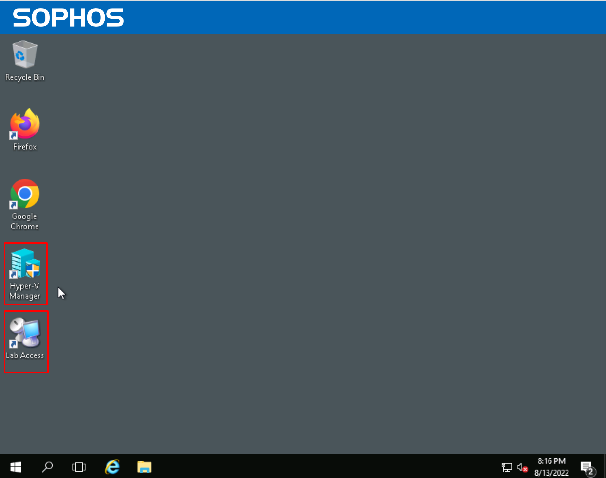
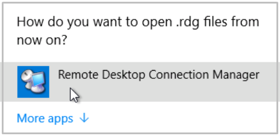
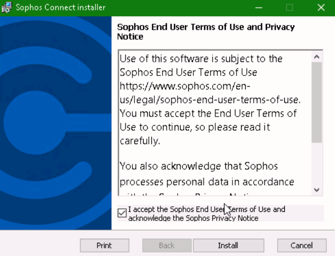
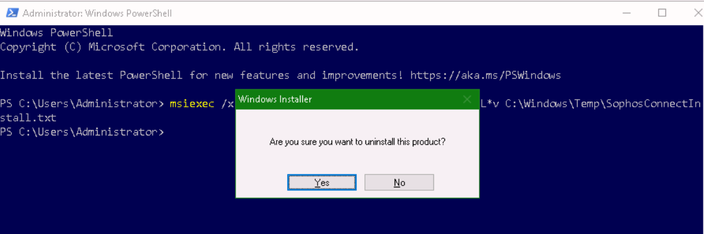
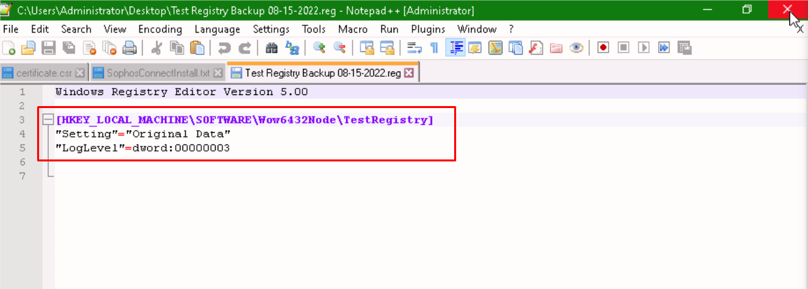
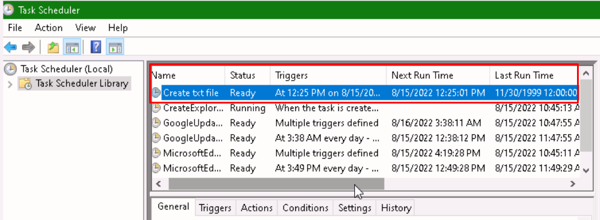

These labs accompany the **Sophos TSE Fundamentals Course**.   
They are estimated to take **10 hours to complete**.

Prior to taking this training, you should have: 
* General networking knowledge
* Understanding of operating systems
* Understanding of Active Directory

***

### Getting Started with the LAB
#### Instructions

1. Your Lab Environment is hosted in CloudLabs and can be accessed through a secure **Emulated RDP session** in your Web browser or **via native RDP connection**. 
You can find the native RDP details in the **Environment details** tab in the upper right corner. 


2. **Once** the environment is **provisioned**, a virtual machine (**HostVM**) on the left and **Lab Guide** on the right will load in your browser.   

3. Make sure the **HostVM** is currently running.
You can verify the **Status** in the **Resource** tab:


3. The **HostVM** on the left of this portal will have several nested Virtual Machines running inside Hyper-V that you will use throughout the workshop to perform the lab. 

> **Note:** Do not use the **HostVM** to perform the lab exercises.

4. **Wait 5 to 10 minutes for all nested VM** in the Hyper-V-Environment to complete startup before to begin.

***
## Accessing the nested Virtual machines:

You can use either
* **Hyper-V**, or
* The **LabAccess** shortcut on the Desktop   


The **"LabAccess"** shortcut on the Desktop opens the **"Remote Desktop Connection Manager"** and allows you to initiate, manage and control each of the virtual machines from a central location.


The left **Dock** displays the tree-list of all the Nested Virtual Machines to be used for this Workshop:


**Tip:** For better display view, auto-hide the Dock in:
> **Tools > Options > Tree > Visibility > AutoHide**

> **Note:** If the shortcut asks "How do you want to open .rdg files?"   


You can find the Remote Desktop Manager application under: 

```bash
C:\RDCMan\RDCMan.exe
```
For further guidance, please download the guide from the LMS here:
https://supportlms.sophos.net/totara/mod/resource/view.php?id=6198

***

# Environment Network Diagram 


Download a copy of the Diagram:
https://supportlms.sophos.net/totara/mod/resource/view.php?id=6860


***
# **Lab 1: Windows Endpoint**

## Objectives
Upon successful completion of this lab, you will be able to:

1. Install and remove applications
2. Perform a registry backup and restore
3. Create a scheduled task to run a script

### Lab Diagram:


***

## **Task 1.1: MSI logging**

In this task we will be looking at MSI files, their logs as well as use Windows
Installer to uninstall.

Access the Lab environment by either using **Hyper-V** or the **"Remote Desktop Connection Manager"**

The first Nested virtual machine you'll be working on is the **"London DC"**

>username: `administrator`
password: `Sophos1985`


1. Open a web browser and navigate to `https://172.16.16.16:4444`

    >**Note:** Proceed through any warnings you receive
2. Login using the username `admin`  

    >**Note:** Password is `Sophos@1985`
    
3. On the left pane, navigate to **Remote Access VPN > IPsec** and click **Download Client**


4. Open Windows Explorer and navigate to the folder the installer was downloaded to and **extract** the contents of the **zip archive**.  
> **Note:** Inspect the content of the archive and check the file extensions of each object extracted.   In the Windows File-Explorer check in **View > File name Extension**


5. **Hold shift** and **right click** an empty area and select:  
 `Open Powershell window here`
6. In PowerShell, Run the following command to install Sophos Connect 2.0:

```Powershell
msiexec /i 'SophosConnect_2.2.75_(IPsec_and_SSLVPN).msi'  /L*v C:\Windows\Temp\SophosConnectInstall.txt
```
or you can run the similar command in the command prompt:

```bash
msiexec /i SophosConnect_2.2.75_(IPsec_and_SSLVPN).msi /L*v C:\Windows\Temp\SophosConnectInstall.txt
```
 >**Note:** The Sophos Connect version in the above command may differ from the current version of the installer.
 > This will start the SophosConnect installer and generate logs into a file named SophosConnectInstall.txt.

 
 7. Follow the on-screen instructions to install Sophos Connect
  
 
 
 8. Use Windows Explorer to navigate to `C:\Windows\Temp\` and with Notepad++ open the **SophosConnectInstall.txt** log file.

 9. Write down the line entry that indicates a successful or failed installation.
 10. Write down the product code of this program.
 11. Uninstall SophosConnect using the same product code with the msiexec command: 
```bash
msiexec /x <Product Code> /L*v C:\Windows\Temp\SophosConnectUninstall.txt
```
12. Follow the instructions

13. Reopen the same log file with Notepad++ and identify any errors while and after uninstalling the application.

##### .png) You have analyzed MSI logs and used Windows Installer to manage PuTTy.

***

<div style='page-break-after: always'></div>


## **Task 1.2: Registry Editor**


In this task we will create and modify a registry key as well as perform
a backup and restore.


1. Open Registry by typing `regedit` in the **Run** window
2. Navigate to: `Computer\HKEY_LOCAL_MACHINE\SOFTWARE\WOW6432Node\`
3. Right click **WOW6432Node** and create a new key named `TestRegistry`
4. Right click **TestRegistry** and create a new String Value named ‘Setting’
5. Double click **Setting** and in the "**Value data**" add this: `Original data`
6. Right click **TestRegistry** and create a new `DWORD` Value named `LogLevel`
7. Double click **LogLevel** and add value data of `3`
8. Select **TestRegistry** on the left pane 
>**Note:** This creates a backup that only include content under:   
`HKLM\SOFTWARE\WOW6432Node\TestRegistry`

9. Click on `File` on the top left and select `Export`
10. Name the file export, accordingly with today's date:  
 `Test Registry Backup <MM-DD-YYYY>`  
 and save this file to the Desktop.

11. Double click the **Settings** registry string and modify the **Value data** to `Modified data`
12. Delete the **LogLevel** `DWORD` registry
13. Open the Test Registry Backup file in Notepad++

> **Note:** All registry backup files can be opened in a text editor. You can confirm the contents before importing the keys back into the registry.

14. Note Down the keys that were backed up

15. Close Notepad++
16. from the Dekstop, Double click the **Test Registry Backup** file to import its contents to the registry. Ignore the Warning and continue.
17. In Registry Editor, navigate back to the same `HKLM\SOFTWARE\WOW6432Node\`
18. Note down the value data of the **Setting** registry key.  
The String and the DWORD should be restored by the backup file.


##### .png) You have successfully backed up and restored a registry key.

***

## **Task 1.3: Task Scheduler**
In this task we will create a scheduled task to run a script at a specific time and date.


1. Open Notepad++, create a new file and write down the following text:

```powershell
echo "Hello World" > C:\Users\Administrator\Desktop\scheduledtask.txt
```

2. **Save** the file in the **Desktop** with the name `script.bat`
3. Close Notepad++
4. Open Task Scheduler by typing `taskschd` in the Run Window 
5. In the left-hand pane, click on **Task Scheduler Library** 
6. Right click and select **Create Task…** 


7. In the **Name** field, enter `Create txt file`
8. Select **Run whether user is logged in or not** 
9. Select the **Triggers tab** 
10. Click **New** 
11. In the **Settings** section set the start time 5 minutes from the current time 
12. Click **OK**
13. Select the Actions tab 
14. Click **New** 
15. In the **Program/script** field browse to the previously created `script.bat` 
16. Click **OK** 
17. Select the **Settings** tab 
18. Select **Run task as soon as possible after as scheduled start is missed** 
19. Click **OK** 
20. Enter the Administrator password `Sophos1985`, then click **OK** 
21. Wait for the scheduled start time, and confirm a file named **scheduledtask.txt** is created on the Desktop.
> **Note:** You may want to refresh the Desktop
22. Validate the "Last Run Time" in the Task Scheduler Console


  
#### .png) You have created a basic scheduled task 

***

##  Review  ##

You have now successfully: 
1.	Used MsiExec to install and remove applications 
2.	Performed a registry backup and restore 
3.	Created a scheduled task to launch Notepad 

***
***
### Before closing this page:
> Please remember to "Deallocate" the "HostVM" in the "Resource Tab" before closing this LAB, 

otherwise please continue to the next LAB.


