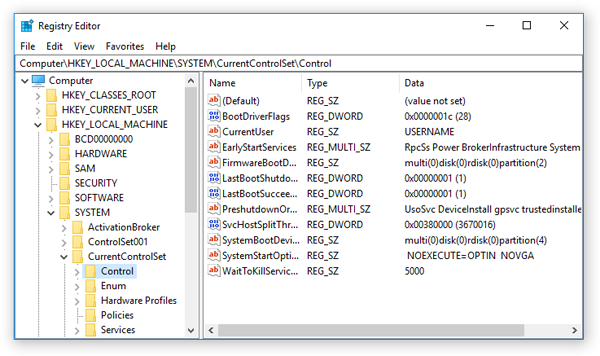

# **Sophos - TSE Fundamentals 2.0 Labs**
## Getting Started
#### Instructions

1. **Once** the environment is **provisioned**, a virtual machine (**HostVM**) on the left and lab guide on the right will get loaded in your browser. Use this virtual machine throughout the workshop to perform the lab.

2. **Wait 5 to 10 minutes for all nested VM** in the Hyper-V- Environment to complete startup before to begin.

3. Your Environment is hosted in CloudLabs and can be accessed through a secure **Emulated RDP session** in your Web browser or **via native RDP connection**.   
You can find the native RDP details in the **Environment details** tab in the upper right corner. 

***

## Environment Network Diagram 

 

***

## Prerequisites
These labs accompany the **Sophos TSE Fundamentals Course**.   
They are estimated to take **10 hours to complete**.

Prior to taking this training, you should have: 
* General networking knowledge
* Understanding of operating systems
* Understanding of Active Directory


***
# **Lab 1: Windows Endpoint -Luca**

## **Objectives:**

Upon successful completion of this lab, you will be able to:

1. Install and remove applications
2. Perform a registry backup and restore
3. Create a scheduled task to run a script

### Lab Diagram:


## **Task 1.1: MSI logging**

In this task we will be looking at MSI files, their logs as well as use Windows
Installer to uninstall.


1. Open a web browser and navigate to `https://172.16.16.16:4444`

    >**Note:** Proceed through any warnings you receive
2. Login using the username 'admin'

    >**Note:** Password is `Sophos@1985`
    
3. On the left pane, navigate to **Configure > VPN > IPsec** (remote access)    
click Download Client 

4. Open Windows Explorer and navigate to the folder the installer was downloaded to and extract the contents of the zip

5. Hold shift and right click an empty area and select:  
 `Open Command window here`
6. Run the following command to install Sophos Connect 2.0:
```javascript
msiexec /i SophosConnect_2.0_(IPsec_and_SSLVPN).msi /L*v C:\Windows\Temp\SophosConnectInstall.txt
```
 
  >**Note:** This will start the SophosConnect installer and generate logs into a file named SophosConnectInstall.txt.
  
 7. Follow the on-screen instructions to install Sophos Connect
 8. Use Windows Explorer to navigate to C:\Windows\Temp\ and open the SophosConnectInstall log file
 9. Write down the line entry that indicates a successful or failed installation:
 10. Write down the product code of this program
 11. Uninstall PuTTY using the product code in the msiexec command: 
```javascript
msiexec /x <Product Code> /L*v C:\Windows\Temp\SophosConnectUninstall.txt
```

:white_check_mark: You have analyzed MSI logs and used Windows Installer to manage PuTTy.

***

<div style='page-break-after: always'></div>


## **Task 1.2: Registry Editor**


In this task we will create and modify a registry key as well as perform
a backup and restore.


1. Open Registry by typing <inject key="Suffix" />`regedit` in the Run Window
2. Navigate to `Computer\HKEY_LOCAL_MACHINE\SOFTWARE\WOW6432Node\`
3. Right click **WOW6432Node** and create a new key named `TestRegistry`
4. Right click **TestRegistry** and create a new String Value named ‘Setting’
5. Double click **Setting** and add value data of **Original data**
6. Right click **TestRegistry** and create a new `DWORD` Value named `LogLevel`
7. Double click **LogLevel** and add value data of `3`
8. Select **TestRegistry** on the left pane 
>**Note:** This creates a backup that only include content under:   
`HKLM\SOFTWARE\WOW6432Node\TestRegistry`

9. Click on `File` on the top left and select `Export`
10. Name the file export, accordingly with today's date:  
 `Test Registry Backup <MM-DD-YYYY>`  
 and save this file to the Desktop.

11. Double click the **Settings** registry string and modify the value data to `Modified data`
12. Delete the **LogLevel** `DWORD` registry
13. Open the Test Registry Backup file in Notepad

>**Note:** All registry backup files can be opened in a text editor. You can confirm the contents before importing the keys back into the registry .

14. Note Down the keys that were backed up
15. Close Notepad
16. Double click the **Test Registry Backup** file to import its contents to the registry
17. In Registry Editor, navigate back to `HKLM\SOFTWARE\WOW6432Node\`
18. Note down the value data of the **Setting** registry key: 

:white_check_mark: You have successfully backed up and restored a registry key.

***

## **Task 1.3: Task Scheduler**
In this task we will create a scheduled task to run a script at a specific time and date.


1. Open Notepad and write down the following text:
```powershell  
echo "Hello World" > C:\Users\Administrator\Desktop\scheduledtask.txt
```
2. Save the file with the name `script.bat`
3. Close Notepad
4. Open Task Scheduler by typing `taskschd` in the Run Window 
5. In the left-hand pane, click on **Task Scheduler Library** 
6. In the right-hand pane, click **`Create Task…`** 
7. In the ‘Name’ field, enter **`Create txt file`** 
8. Select `Run` whether user is logged in or not 
9. Select the Triggers tab 
10. Click `New…` 
11. In the **Settings** section set the start time 5 minutes from the current time 
12. Click `OK` 
13. Select the Actions tab 
14. Click `New…` 
15. In the `Program/script` field browse to the previously created `script.bat` 
16. Click `OK` 
17. Select the **Settings** tab 
18. Select Run task as soon as possible after as scheduled start is missed 
19. Click `OK` 
20. Enter the Administrator password `Sophos1985`, then click **OK** 
21. Wait for the scheduled start time and confirm a file named scheduledtask is created on the Desktop 
  
####  :white_check_mark: You have successfully created a basic scheduled task 

***

## :beginner: Review  ##

You have now successfully: 
1.	Used MsiExec to install and remove applications 
2.	Performed a registry backup and restore 
3.	Created a scheduled task to launch Notepad 

***


