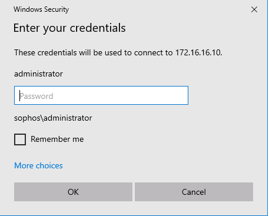

These labs accompany the **Sophos TSE Fundamentals Course**.   
They are estimated to take **10 hours to complete**.

Prior to taking this training, you should have: 
* General networking knowledge
* Understanding of operating systems
* Understanding of Active Directory

***

### Getting Started with the LAB
#### Instructions

1. Your Lab Environment is hosted in CloudLabs and can be accessed through a secure **Emulated RDP session** in your Web browser or **via native RDP connection**. 
You can find the native RDP details in the **Environment details** tab in the upper right corner. 


2. **Once** the environment is **provisioned**, a virtual machine (**HostVM**) on the left and **Lab Guide** on the right will load in your browser.   

3. Make sure the **HostVM** is currently running.
You can verify the **Status** in the **Resource** tab:


4. The **HostVM** on the left of this portal will have several nested Virtual Machines running inside Hyper-V that you will use throughout the workshop to perform the lab. 

> **Note:** The **HostVM** is not to be used for lab exercises.

5. **Before starting** the exercises, **allow 5 to 10 minutes** for all nested VMs in the Hyper-V environment to complete the boot-up.

***
## Accessing the nested Virtual machines:

You can use either:
* **Hyper-V**, or
* The **LabAccess** shortcut on the Desktop   


The **"LabAccess"** shortcut on the Desktop opens the **"Remote Desktop Connection Manager"** and allows you to initiate, manage and control each of the virtual machines from a central location.


The left **Dock** displays the tree-list of all the Nested Virtual Machines to be used for this Workshop:


>**Tip:** For better display view, auto-hide the Dock in:
>>> **Tools > Options > Tree > Visibility > AutoHide**

> **Note:** If the shortcut asks "How do you want to open .rdg files?"   


You can find the Remote Desktop Manager application under: 

```bash
C:\RDCMan\RDCMan.exe
```
For further guidance, please download the guide from the LMS here:
https://supportlms.sophos.net/totara/mod/resource/view.php?id=6198

***

# Environment Network Diagram 


Download a copy of the full Diagram:
https://supportlms.sophos.net/totara/mod/resource/view.php?id=6860


***
# **Lab 1: Windows Endpoint**

## Objectives
Upon successful completion of this lab, you will be able to:

1. Install and remove applications
2. Perform a registry backup and restore
3. Create a scheduled task to run a script
4. Verifying Windows Services
5. Creating Custom view in Event Viewer 

### Lab Diagram:


***

## **Task 1.1: MSI logging**

In this task, we’ll be looking at the MSI files, and their logs as well as using Windows Installer to uninstall. 

Access the Lab environment by either using **Hyper-V** or the **"Remote Desktop Connection Manager"**


Logon on London-DC using the following:

Username: **administrator**

Password: **Sophos1985**



1. Open a web browser and navigate to `https://172.16.16.16:4444`

>**Note:** Proceed through any warnings you receive

2. On the welcome page of Sophos Firewall log in using the following credentials:

> Username: **admin**

> Password: **Sophos@1985**
    
3. On the left pane, navigate to **Remote Access VPN > IPsec** and click **Download Client**

> This will download the zip archive in the downloads folder.

4. Open Windows **File Explorer** and navigate into the folder where the installer was downloaded.  

5. Extract the contents of **sophosconnect_installer.zip** in the Downloads folder.
> **Note:** Inspect the content of the archive and check the file extensions of each object extracted.   In the Windows File-Explorer check in **View > File name Extension**


6. Navigate to the Downloads folder. Hold **shift** and **right-click** an empty area and select **Open PowerShell window here**.
7. In PowerShell, Run the following command to install **Sophos Connect 2.0**:

```Powershell
msiexec /i 'SophosConnect_2.2.75_(IPsec_and_SSLVPN).msi'  /L*v C:\Windows\Temp\SophosConnectInstall.txt
```

 >**Note:** The Sophos Connect version in the above command may differ from the current version of the installer.
 > This will start the SophosConnect installer and generate logs into a file named SophosConnectInstall.txt.

 
 8. Follow the on-screen instructions to install Sophos Connect
  
 
 
 9. Use Windows Explorer to navigate to `C:\Windows\Temp\` and with Notepad++ open the **SophosConnectInstall.txt** log file.

 10. Write down the line entry that indicates a successful or failed installation.
 11. Write down the product code of this program.
 12. Uninstall SophosConnect using the same product code with the msiexec command using Powerhell:
```bash
msiexec /x "{xxxx-Product Code-xxxx}" /L*v C:\Windows\Temp\SophosConnectUninstall.txt
```
13. Follow the instructions to uninstall the Sophos Connect App.


14.  Verify the log file for a successful uninstall.  Close all the open windows.


##### .png) You have analyzed MSI logs and used Windows Installer to manage SophosConnect.

***

## **Task 1.2: Registry Editor** 


In this task we will create and modify a registry key as well as perform
a backup and restore.


#### Connect to the London DC 


1. On LON-DC, open Registry by typing **regedit** in the Run window. Navigate to Computer **Computer\HKEY_LOCAL_MACHINE\SOFTWARE\WOW6432Node**

2. Right-click **WOW6432Node** and create a new key named ‘**TestRegistry**’

3. Right-click **TestRegistry** and create a new String Value named ‘**Setting**’

4. Double click **Setting**, and in the "Value data" add this: ‘**Original data**’

5. Right-click **TestRegistry** and create a new DWORD Value named ‘**LogLevel**’

6. Double click **LogLevel** and add value data of 3

7. Select **TestRegistry** on the left pane and click **Export**

> Note: This creates a backup that only includes content under: **HKLM\SOFTWARE\WOW6432Node\TestRegistry**


8. Save the file to the Desktop  and Name the file export, accordingly to today's date:
**TestRegistry Backup**


9. Double click the **Settings** registry string and change the Value data to ‘**Modified data**’

10. Delete the **LogLevel** DWORD registry.

11. Switch to the desktop and open the **TestRegistry Backup file** in Notepad++

> Note: All registry backup files can be opened in a text editor. You can confirm the contents before importing the keys back into the registry.


12. Make a note of the keys that were backed up and Close Notepad++


> **Note:** All registry backup files can be opened in a text editor. You can confirm the contents before importing the keys back into the registry.

13. From the Desktop, Double click the **TestRegistry Backup file** to import its contents to the registry. Ignore the Warning and continue.

14. In Registry Editor, navigate back to the same **HKLM\SOFTWARE\WOW6432Node**

Note down the value data of the setting registry key.


15. The String and the DWORD should be restored by the backup file.


16.  Close all the open windows.

##### .png) You have successfully backed up and restored a registry key.

***

## **Task 1.3: Task Scheduler**
In this task we will create a scheduled task to run a script at a specific time and date.


1. Open Notepad++, create a new file and write down the following text:

```powershell
echo "Hello World" > C:\Users\Administrator\Desktop\scheduledtask.txt
```

2. **Save** the file in the **Desktop** with the name `script.bat`
3. Close Notepad++
4. Open Task Scheduler by typing `taskschd` in the Run Window 
5. In the left-hand pane, click on **Task Scheduler Library** 
6. Right click and select **Create Task…** 


7. In the **Name** field, enter `Create txt file`
8. Select **Run whether user is logged in or not** 
9. Select the **Triggers tab** 
10. Click **New** 
11. In the **Settings** section set the start time 5 minutes from the current time 
12. Click **OK**
13. Select the Actions tab 
14. Click **New** 
15. In the **Program/script** field browse to the previously created `script.bat` 
16. Click **OK** 
17. Select the **Settings** tab 
18. Select **Run task as soon as possible after as scheduled start is missed** 
19. Click **OK** 
20. Enter the Administrator password `Sophos1985`, then click **OK** 
21. Wait for the scheduled start time, and confirm a file named **scheduledtask.txt** is created on the Desktop.
> **Note:** You may want to refresh the Desktop
22. Validate the "Last Run Time" in the Task Scheduler Console


  
#### .png) You have created a basic scheduled task 

***
## **Task 1.4 : Verifying Windows Services** 

In this task, you’ll investigate the status of services running on windows and check their dependency services.


1. To open services, press the **Windows Key + R** and type in `services.msc`.
This will show you all the services that are available on the endpoint.

2. Observe the different services that are used by Windows Endpoint.

3. Double Click **Windows Defender Firewall service**
Make a note of the following:

> **Status:**

> **Log on:**

> **Dependencies:**

4. Close the dialog box.

5. Double Click Windows Defender Advanced Threat Protection Service

Make a note of the following:

> **Status:**

> **Log on:**

> **Dependencies:**

6. Close all open windows.

#### .png) You have verified services running on windows 
***
## **Task 1.5: Custom view in Event Viewer**


In this task, you’ll learn how to use filters to create custom views in the Windows Event Viewer

1. On **LON-DC**, open **Event Viewer** by typing `eventvwr` in the Run window..

2. In the Event viewer window, expand **Custom Views** in the top left

3. **Right-Click** Custom views and select **Create Custom View..** from the menu


4. In the **Create Custom View** dialog on the **Filter** tab,
     
     4.1 Select `Last 12 hours` from the drop-down menu.
     
     4.2 Event Level select **Critical**, **Error Warning** and **Information**
     
     4.3 Select **By source** and then **Services** and **Service Control Manager** from the drop-down menu.
     
     
     4.4 Click **OK**.
     
     4.5 In the **Save Filter to Custom View** dialog, give the new custom view the name `Service Logs` and click **OK**. You should be able to see logs related to Services.
     
5. Open the **Services console** using `service.msc` in the run command.

6. Right- Click the **Plug and Play** service and Click **Restart**.

7. Go to the Event viewer and **right click** the Service log and click **refresh**. 

8. Check for the event on the event logs for **Plug and play** service.


#### .png)  You have created a Custom view in Event Viewer
***


##  Review  ##

You have now successfully: 
1.	Used MsiExec to install and remove applications 
2.	Performed a registry backup and restore 
3.	Created a scheduled task to launch Notepad 
4. Verifying Windows Services
5. Creating Custom view in Event Viewer

***
***
### Before closing this page:
> Please remember to "Deallocate" the "HostVM" in the "Resource Tab" before closing this LAB, 

otherwise please continue to the next LAB.


