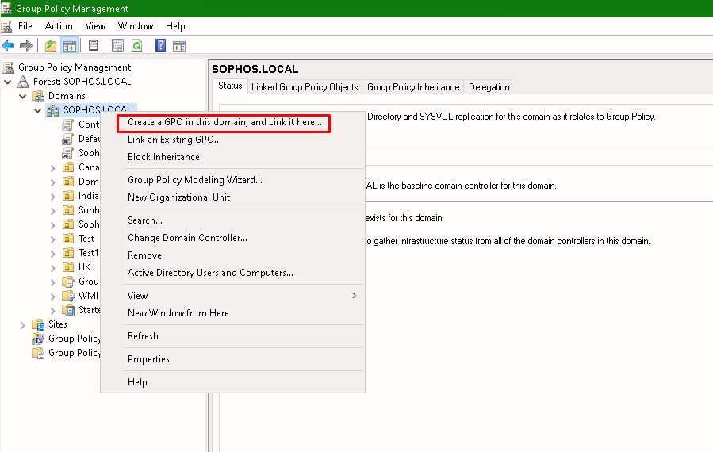
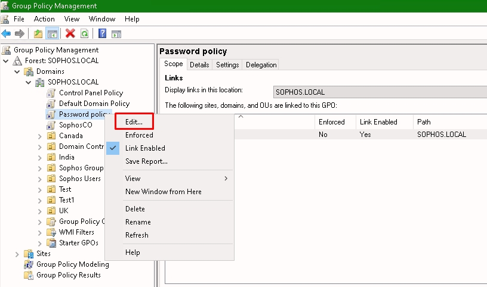
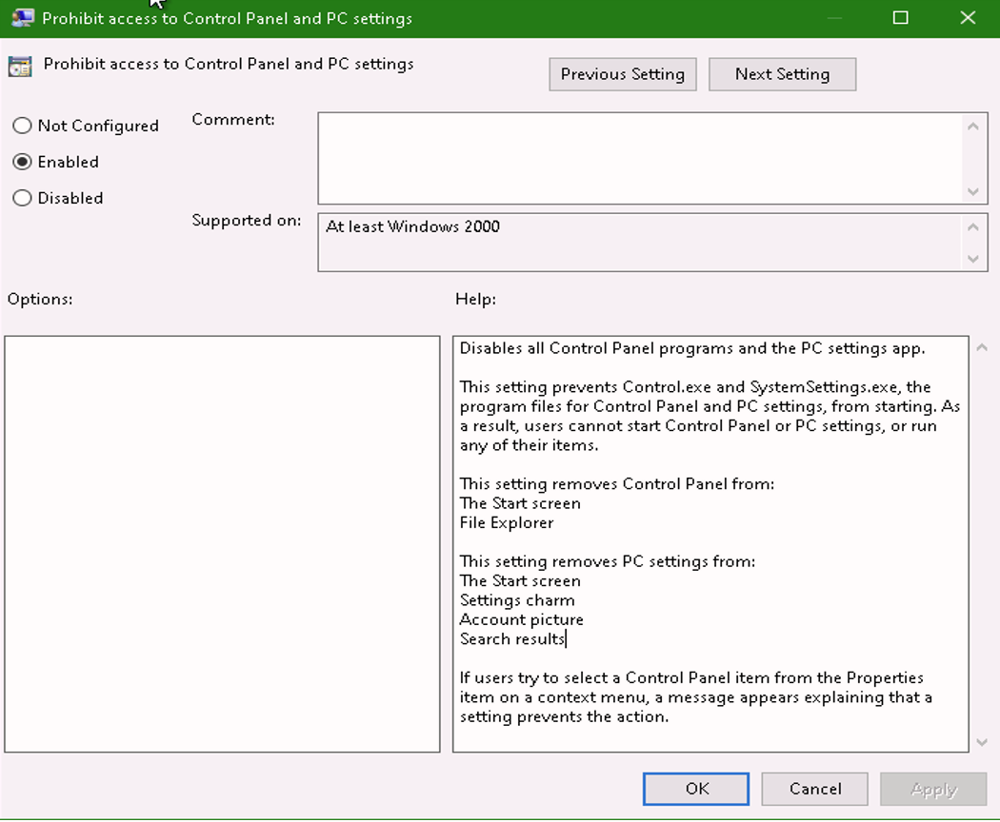
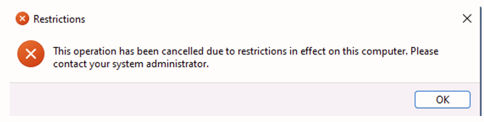
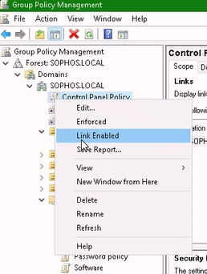

# **Lab 2: Windows Server**

## Objectives
Upon successful completion of this lab, you will be able to: 
1. Review roles installed on a Windows Server
2. Apply password complexity requirements using Group Policies 


### Lab Diagram:


***

## **Task 2.1** Review Roles
You have recently been given access to the Domain Controller. Your task is disable Control Panel for users.


1. Open **Server Manager** and select **Manage > Add Roles and Features**  

2. Read the **‘Before you begin’** message and click **Next** 

3. Keep **‘Role-based or feature-based installation’** selected and click **Next** twice  

4. Note down the server roles installed on this server.   
> You want to make sure that "Active Directory Domain Service" role is active.

5. Click **Cancel** to exit out of Add Roles and Features 


----
## **Task 2.2** Modify Group Policies

1. From the same **Server Manager**, navigate in **Tools** and open **Group Policy Management** 


2. Navigate into the Forest: `SOPHOS.LOCAL > Domains > SOPHOS.LOCAL`

3. Right-click `SOPHOS.LOCAL` and select:   
**Create a GPO in this domain and link it here…**  


4. In the **‘Name’** field enter **"Control Panel Policy"** then hit **OK**   


 
5. Right-click Password policy and select **Edit…**  



6. in the left-hand panel, select: 
`User Configuration > Policies > Administrative Templates > Control Panel`

7. Double click **"Prohibit access to Control Panel and PC settings"**


8. Set the policy to **"Enabled"** and Click **OK**

9. Login in the London Client as:
* User: `SOPHOS\jsmith`
* Password: `Sophos1985`


10. Open the **PowerShell** with elevated permissions and invoke the following command:
```powershell
gpupdate /force
```

11. Click on windows John Smith and Sign out

12. To test the new settings, log off and log back as Jsmith

13. Try opening Control Panel. The policy will prevent access of the Control Panel with the following pop-up: 



14.	Close the warning pop-up and log out the current user.

15.	Switch to London DC

16.	Open **Group Policy Management** console.

17.	Now let's disable the same policy by Right-Click on **Control Panel Policy** untick **Link Enabled**. This will disable the GPO Link and hence won’t apply the GPO settings anymore.


18.	Close **Group Policy Management** console and all the other open windows.

19.	see more information about the PowerShell command here: https://activedirectorypro.com/gpupdate-command/


### .png) You have successfully noted down the installed features on a server and created a group policy

***

##  Review  ##

You have now successfully: 
*	Reviewed roles installed on a Windows Server
*	Disable control panel settings using Group Policies
*	Applying the GPO’s and testing the results.


***
***
### Before closing this page:
> Please remember to "Deallocate" the "HostVM" in the "Resource Tab" before closing this LAB, 

otherwise please continue to the next LAB.


