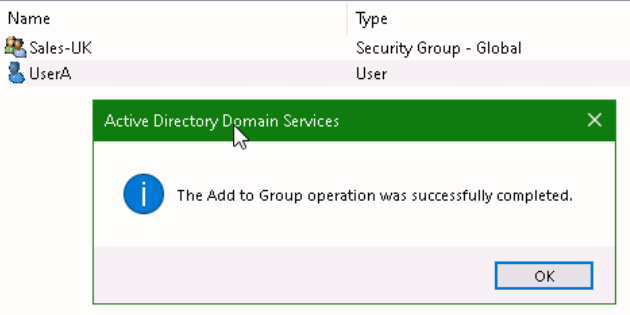
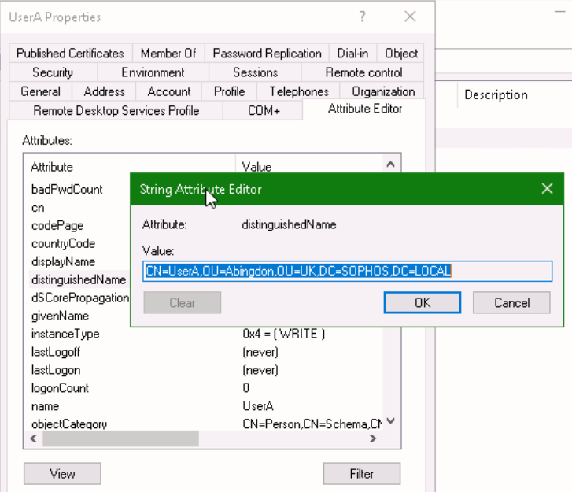

# **Lab 3: Active Directory**

## Objectives
Upon successful completion of this lab, you will be able to: 
1.	Create OUs, groups, and users in Active Directory 
2.	Modify and identify both user and group attributes 

***

### Lab Diagram:

***

## **Task 3.1:** OU, Group and User Configuration 

You have been assigned a task to setup a user, group and an OU in Active Directory: 
  

1. From the **Server Manager > Tools** open the **Active Directory Users and Computers** console, 

**right-click** `SOPHOS.LOCAL`, and select **New** to create three **OUs** with the following names: 
>* `UK` 
>* `Canada`
>* `India` 

2. Using the same steps above, under the previously created **OUs**, create three new **sub-OUs** with the following names:
  
| OU | Sub-OU   |
|----|----------|
| UK | `Abingdon` |
|Canada| `Vancouver` |
| India | `Ahmedabad` |

 3. Now, create two **users** in each **sub-OU**:
 
| OU |	User  |
|----|--------|
| Abingdon | `UserA`, `UserB` |
| Vancouver |	`UserC`, `UserD` |
| Ahmedabad |	`UserE`, `UserF` |
> **Note:** leave the password field empty and press **Finish** to create the user

4. Create the Group "**Sales-UK**" in the "**Abingdon OU**" 

5. Right-click "**UserA**" and select **"Add to a group..."**    
Type `Sales-UK` in the search box and confirm with **"Check Names"**

6. Press **OK** twice; a confirm prompt should appear:

7. Use the same steps above to create another Group "**Finance**" in the "**Ahmedabad OU**" and add "**UserF**" to it.

8. Leave the "**Active Directory Users and Computers**" console open for the next Task.

#### .png) You have succesfully created OUs, Users, and Groups in Active Directory

***

## **Task 3.2:** <small>User and Group Attribute Troubleshooting</small> 
You have been asked to troubleshoot the following task in Active Directory

  
1. List the **distinguished name** for **‘UserA’** and **‘UserD’**.

***
#### How to find the **"distinguishedName"** of an OU**</u>:

> * In the "**Active Directory Users and Computers**" console, select **View > Advanced Features**.
> * Navigate and right-click the **OU** where you want to read users information, then select **Properties**.
> * In the **OU Properties**, select the **Attribute Editor** tab.   
> * Click on **distinguishedName** to highlight it, then click **View**
> * Example: 
***

2. Write down the **Mail**, **UserPrincipalName** and the **sAMAccountName** attribute for user ‘**Jane Doe**’:
3. Write down the displayName, GroupID and **Common Name** for user ‘**Lucy Fox**’:
4. Write down the **objectGUID** and **Distinguished name** for group ‘**Sales**’:

##### .png) You have successfully verified user and group attributes 

***

##  Review  ##

You have now successfully: 
* Created OUs, groups, and users in Active Directory 
* Modified and identified both user and group attributes 

