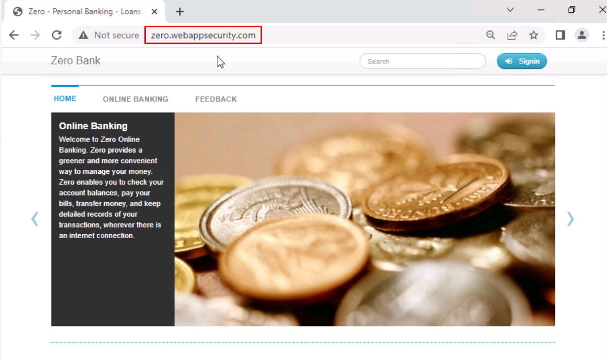
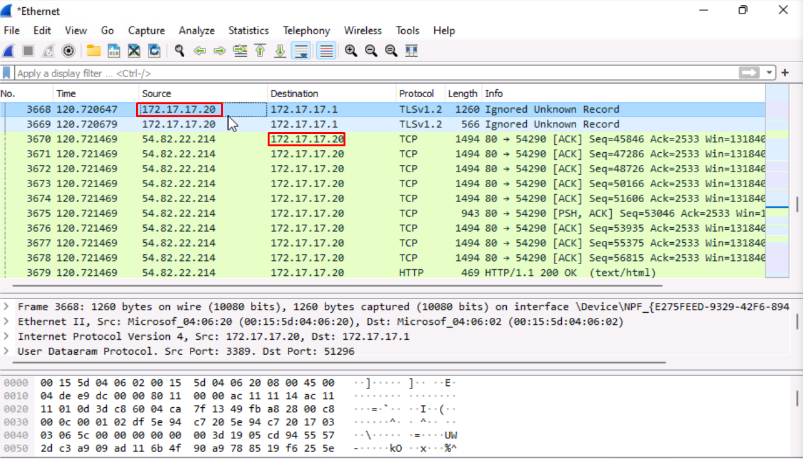
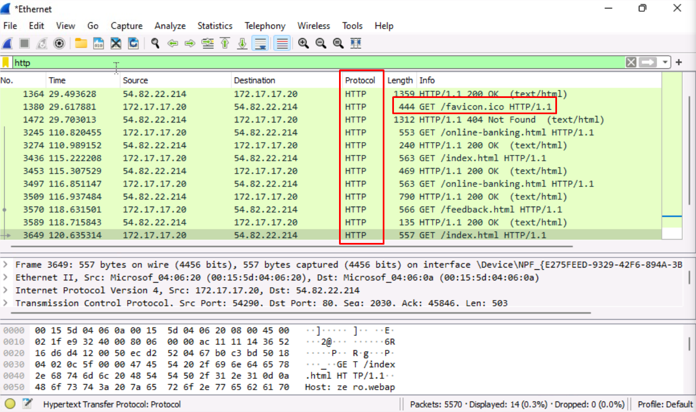
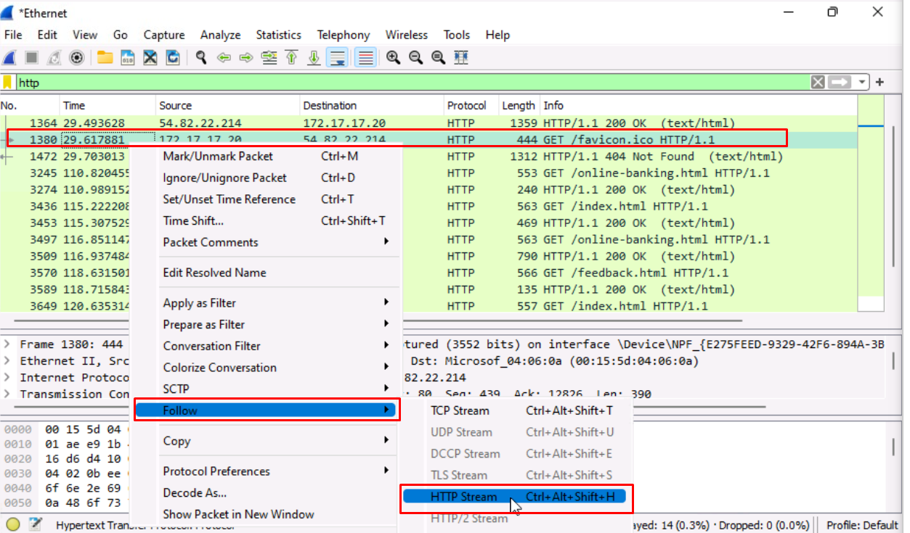
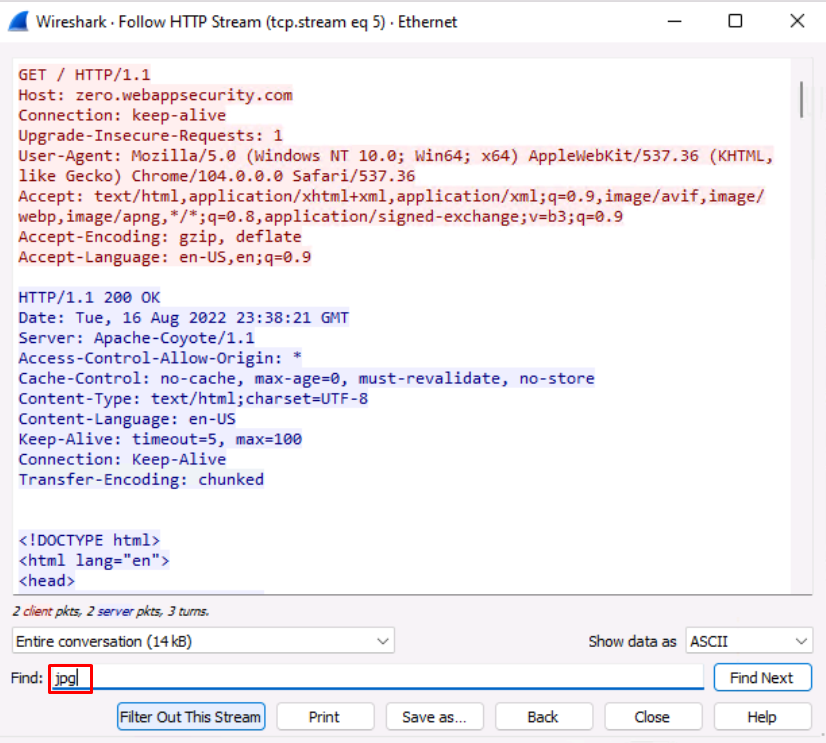
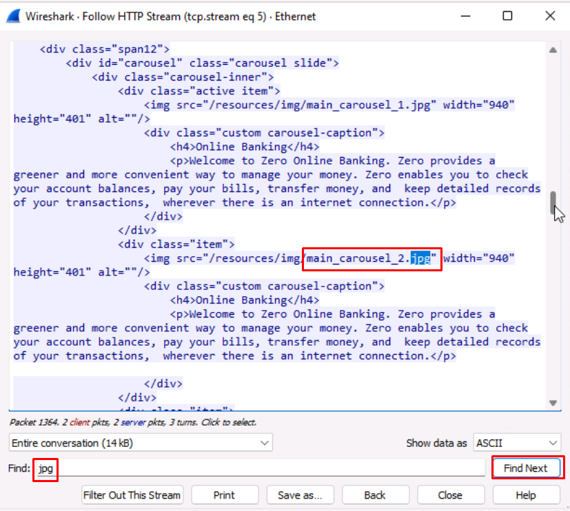
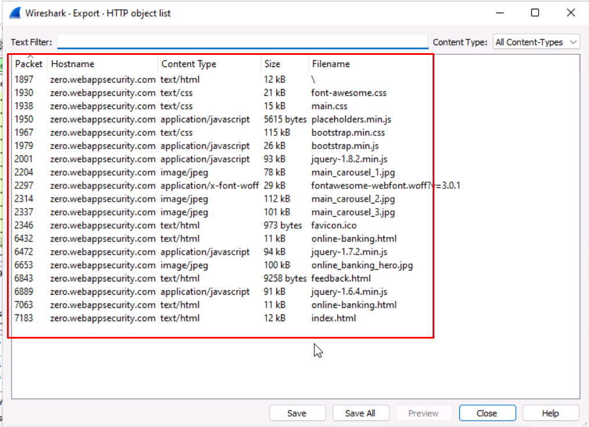
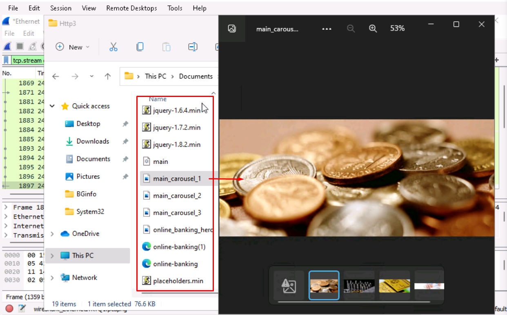
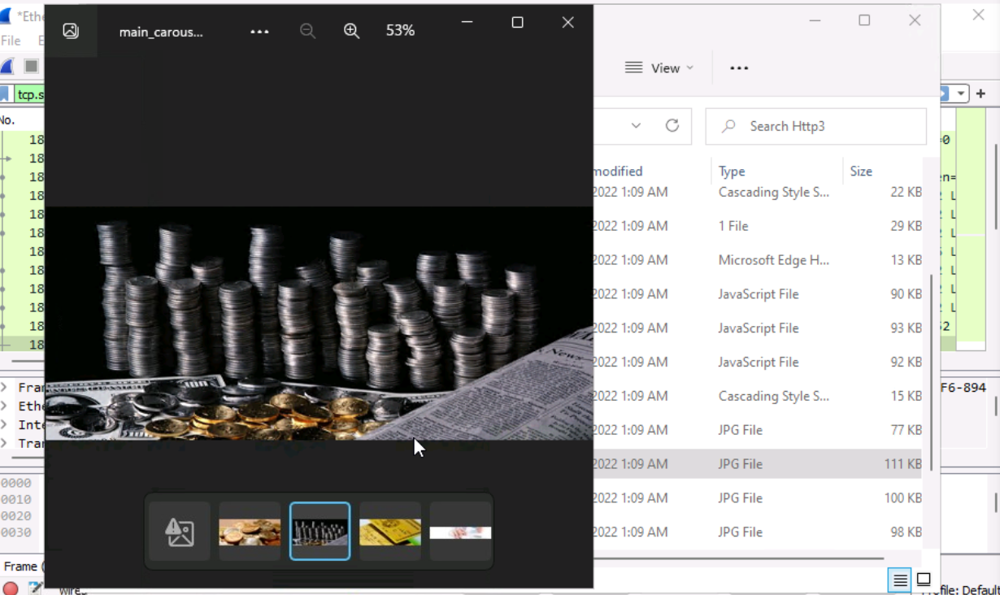

# **Lab 5: Tools**

## Objectives
Upon successful completion of this lab, you will be able to: 
1.	Understand the uses of the **Process Monitor** Tool  
2.	Understand the uses of the **Process Explorer** Tool  
3.	Utilize **Wireshark** to capture and filter traffic 

### Lab Diagram:

***

## **Task 5.1:** Debug with Process Monitor Tool
You have been given a task where you need to capture all events i.e., Registry activity, File System activity, Network activity and Thread activity, while accessing a website from Google Chrome. 

#### Let's begin:
  

1. Open **Process Monitor** and start a capture;   
use the shortcut in the Desktop: "**Procmon64**"

2. Open **Google Chrome** and browse any website
3. Go back to **Procmon64** and in the "Filter" tab on top, apply a filter for all "chrome.exe" processes and all its **subtrees**.

> **Note:**  You could also apply a similar filter by right-click "chrome.exe" in the list of all captured processes. 

4. Once the filter is up, note down all the **PIDs** used by Google Chrome associates.
5. Save the filtered capture as a **PML** file  
 and write down all the distinct types of events.

##### .png) You have successfully debugged using the Process Monitor Tool

***

## **Task 5.2:** <small>Debug with Process Explorer</small> 
You have been asked to debug information using the command prompt with the help of the Process Explorer tool  

  
1. Open the **Process Explorer** using the shortcut from the Desktop.

2. Open the Windows CMD prompt.

3. Back in the **Process Explorer**, now find the Command Prompt process, right click and select "**Properties**" to check all the information about **PID**, **Company Name**, **CPU**, **Memory Usage** 

4. Review all the available options and tabs from the dialog box

> These options include:
> * Kill Process, 
> * Create Dump, 
> * Virus Total check (Brand New Feature!) 
> * Restart, Suspend a process
> * Verify Image Signatures 

5. Save the filtered capture for Command prompt in Process Explorer Data (**.txt**) **format** 

#### .png)  You have successfully performed a debug using Process Explorer 

***

## **Task 5.3:** <small>Wireshark Debugging</small> 

You have been asked to obtain information about active peers in the network from a Wireshark capture.  
Start practicing using the advanced **Wireshark Display-Filters** to quickly analyze and extract valuable information about network traffic.

1. Open **Wireshark**, and start a packet capture from the "**Ethernet**" interface.

2. Now, open **Chrome or Firefox** and attempt to access any **HTTPs** based Website.
> **e.g.,** `https://www.sophos.com`

3. Go back to Wireshark and observe the packets being captured in the "**Packet List Pane**" as soon as they leave/enter the Ethernet interface.

4. Research and Note down the **Display-Filters** and the respective syntax to quickly highlight and extract the following information:
*	Wireshark Filter **by IP** 
*	Wireshark Filter **by Port**  
*	Wireshark Filter **by IP** and Port 
*	**Mac Address** Filter 
*	Filter **by URL** 
*	**Trace TCP Stream** for website communication 
*	**Filter out** Destination IP address

>**Note:** You can find a useful **cheat list** of Display-Filters here:
> https://packetlife.net/media/library/13/Wireshark_Display_Filters.pdf
 
5. Save the capture in **PCAP format** after validating.

#### .png) You have successfully utilized filters with Wireshark 

***
## **Task 5.4:** <small>Wireshark for Image Capture and Extraction</small> 
Through traffic capture, Wireshark can be used to view and record all information during transit,
if this data is unencrypted such as images flowing to a device, Wireshark will record them and save the traffic information which can be extracted into Jpeg formats to be later collected for forensic evidences.  
In this task, We will browse the internet to an HTTP site while capturing the traffic with Wireshark. We'll then review the captured packets and extract the images which were sent from the website to the London-Client.

>**Note:** Note: In this exercise, you will access external websites, as these websites are
outside of our control, they are subject to change. If you do notice anything is out
of date, please let us know via our support desk so we can implement an update.

1. **Run Wireshark as administrator** and launch a new capture on the **Ethernet** interface.

2. Minimize Wireshark and launch **Google Chrome**. Type into the search bar:
http://zero.webappsecurity.com

>**Note** It is important to access an HTTP site as the information is transmitted in
plaintext.

3. Now, access the article and **browse around the site** to allow **Chrome** to load all the pictures and content. Ideally, it's better if there are plenty of images to view on the page.

4. By now, we should have generated enough traffic flow from the website to the London-Client. Switch back to **Wireshark** and **stop** the traffic **capture**.

5. We also know the IP address of the **London-Client `172.17.17.20`**, and scrolling through the capture, we will see the IP address listed in this capture.
We also see plenty of information about the **HTTP protocol**, and in the **Info tab**, we
can see http://zero.webappsecurity.com. Great, that is the website we used.

6. Now on the top **filter bar**, enter the **Display-Filter** `HTTP` and hit enter.

Initially looking at the capture, we have a lot of information. But we know we were
using **HTTP traffic**. Therefore, within the filter we are presented with
only traffic on this protocol now.The majority of which comes from the **IP address 172.17.17.20**, as this was the main machine accessing the internet.

7. Now click on one of the **HTTP packets**, which has a source address of 172.17.17.20, 
and it begins with the words `GET http://zero.wepappsecurity.com`.

8. Right-click and choose "**Follow > HTTP stream**".

9. Here we see plenty of detailed information about the `GET HTTP` site, the **language**, the
**Host address**, and **cookie information**. Moving down this page, you will see **CSS information** and **font family details**

10. Type the following into the **Find field**: `jpg`
Press Enter to find image details.

11. Here we can see many **jpeg** files on the webpage, and hopefully, we have captured all
those which were viewing in the webpage with **Chrome.**

12. Now we will specifically look for a file called `main_carousel_2.jpg`, but you can
choose any file you like as the process is exactly the same.

>**Note:** You can use the "**Find Next**" button to see the `carousel_2.jpg`

13. Now close the "**Follow HTTP Stream**" box, and in Wireshark go to:
**File > Export Objects> HTTP**. A list of objects captured is shown here.

14. You can either save only the one you are interested in or **save all in a folder**. Let’s save all of them by clicking the "**Save All**" button to the **Documents folder**.

15. After saving the images to the folder, minimize Wireshark.
Go to your File Manager and open up the folder where you saved all files.

15. Here you can see all the objects and **jpeg** files from that http stream of packets, including the **main_carousel_2.jpg file**

>  **Important Note:** If there is no jpeg files extracted you may want to **clear all the browsing data** data in **Chrome** and repeat the process from Step1.

16. Observe and all the files extracted from the **HTTP stream**.

#### .png) You have successfully done Packet Sniffing for Image Capture and Extraction with Wireshark.

***
##  Review  ##

In this Lab you have: 
* Debugged using Process Monitor Tool
* Debugged using Process Explorer Tool
* Wireshark Debugging

***
***
### Before closing this page:
> Please remember to "Deallocate" the "HostVM" in the "Resource Tab" before closing this LAB, 

otherwise please continue to the next LAB.

