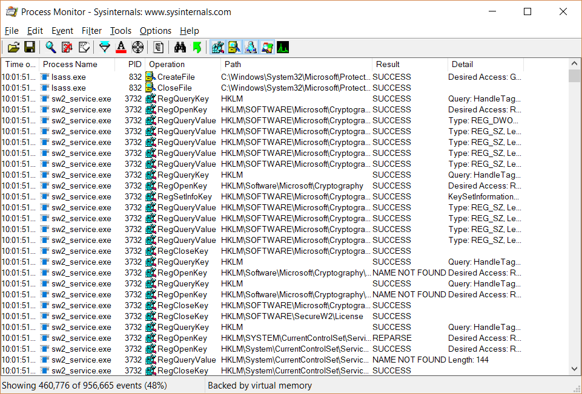
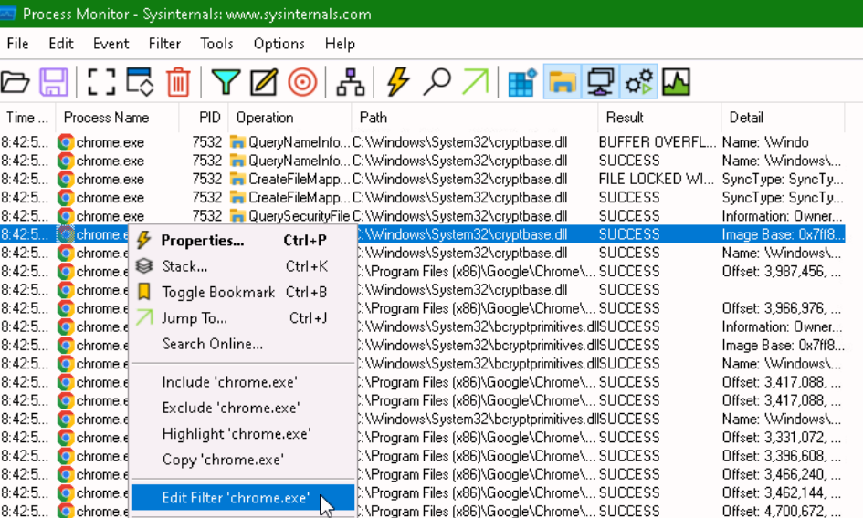
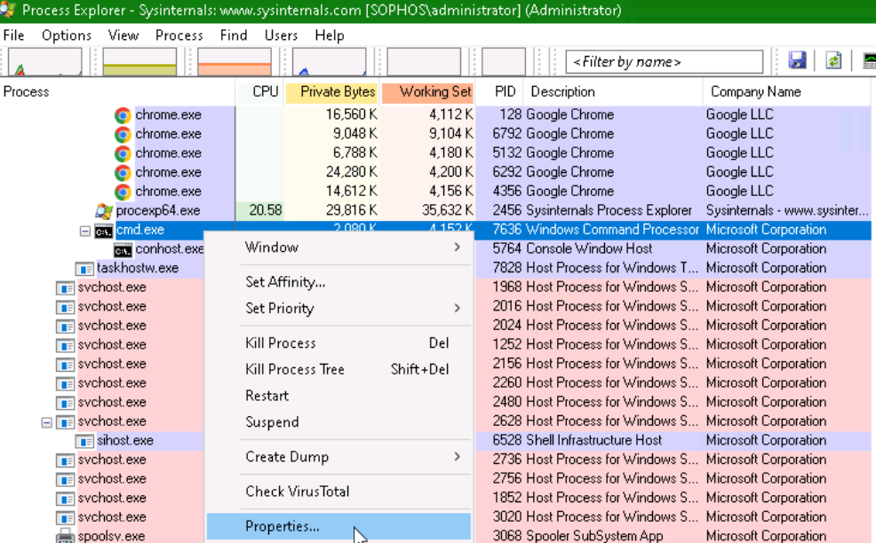
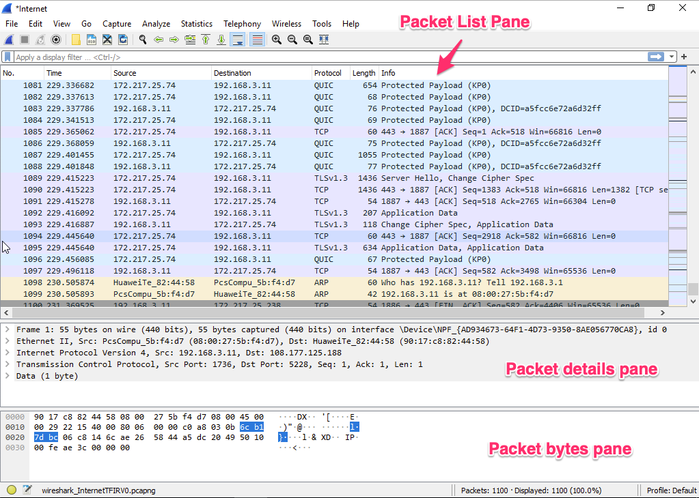

# **Lab 5: Tools**

## Objectives
Upon successful completion of this lab, you will be able to: 
1.	Understand the uses of the **Process Monitor** Tool  
2.	Understand the uses of the **Process Explorer** Tool  
3.	Utilize **Wireshark** to capture and filter traffic 

### Lab Diagram:

***

## **Task 5.1:** Debug with Process Monitor Tool
You have been given a task where you need to capture all events i.e., Registry activity, File System activity, Network activity and Thread activity, while accessing a website from Google Chrome. 

#### Let's begin:
  

1. Open **Process Monitor** and start a capture;   
use the shortcut in the Desktop: "**Procmon64**"

2. Open **Google Chrome** and browse any website
3. Go back to **Procmon64** and in the "Filter" tab on top, apply a filter for all "chrome.exe" processes and all its **subtrees**.

> **Note:**  You could also apply a similar filter by right-click "chrome.exe" in the list of all captured processes. 

4. Once the filter is up, note down all the **PIDs** used by Google Chrome associates.
5. Save the filtered capture as a **PML** file  
 and write down all the distinct types of events.

##### .png) You have successfully debugged using the Process Monitor Tool

***

## **Task 5.2:** <small>Debug with Process Explorer</small> 
You have been asked to debug information using the command prompt with the help of the Process Explorer tool  

  
1. Open the **Process Explorer** using the shortcut from the Desktop.

2. Open the Windows CMD prompt.

3. Back in the **Process Explorer**, now find the Command Prompt process, right click and select "**Properties**" to check all the information about **PID**, **Company Name**, **CPU**, **Memory Usage** 

4. Review all the available options and tabs from the dialog box

> These options include:
> * Kill Process, 
> * Create Dump, 
> * Virus Total check (Brand New Feature!) 
> * Restart, Suspend a process
> * Verify Image Signatures 

5. Save the filtered capture for Command prompt in Process Explorer Data (**.txt**) **format** 

#### .png)  You have successfully performed a debug using Process Explorer 

***

## **Task 5.3:** <small>Wireshark Debugging</small> 

You have been asked to obtain information about active peers in the network from a Wireshark capture.

1. Open **Wireshark**, and start a packet capture from the "**Ethernet**" interface.

2. Now, open **Chrome or Firefox** and attempt to access any **HTTPs** based Website.
> **e.g.,** `https://www.sophos.com`

3. Go back to Wireshark and observe the packets being captured in the "**Packet List Pane**" as soon as they leave/enter the Ethernet interface.

4. Research and Note down the Display-Filters and the respective syntax to quickly highlight and extract the following information:
*	Wireshark Filter **by IP** 
*	Wireshark Filter **by Port**  
*	Wireshark Filter **by IP** and Port 
*	**Mac Address** Filter 
*	Filter **by URL** 
*	**Trace TCP Stream** for website communication 
*	**Filter out** Destination IP address
 >**Note:** You can find a useful cheat list of Display-Filters here:
 https://packetlife.net/media/library/13/Wireshark_Display_Filters.pdf
 
5. Save the capture in **PCAP format** after validating.

##### .png) You have successfully utilized filters with Wireshark 

***

##  Review  ##

You have now successfully: 
* Debugged using Process Monitor Tool
* Debugged using Process Explorer Tool
* Wireshark Debugging

***
***
### Before closing this page:
> Please remember to "Deallocate" the "HostVM" in the "Resource Tab" before closing this LAB, 

otherwise please continue to the next LAB.

