# **Lab 5: Tools**

## Objectives
Upon successful completion of this lab, you will be able to: 
1.	Understand the uses of the **Process Monitor** Tool  
3.	Utilize **Wireshark** to capture and filter traffic 
4.	Utilize **TCPDUMP** to capture and filter traffic from the command line

### Lab Diagram:


***

## **Task 5.1:** Debug with Process Monitor Tool
You have been given a task where you need to capture all events i.e., Registry activity, File System activity, Network activity and Thread activity, while accessing a website from Google Chrome. 

#### Let's begin:
  

1. Open **Process Monitor** and start a capture;   
use the shortcut in the Desktop: "**Procmon64**"


2. Open **Google Chrome** and browse any website
3. Go back to **Procmon64** and in the "Filter" tab on top, apply a filter for all "chrome.exe" processes and all its **subtrees**.

> **Note:**  You could also apply a similar filter by right-click "chrome.exe" in the list of all captured processes. 

4. Once the filter is up, note down all the **PIDs** used by Google Chrome associates.
5. Save the filtered capture as a **PML** file  
 and write down all the distinct types of events.

##### .png) You have successfully debugged using the Process Monitor Tool


***


## **Task 5.2:** <small>Wireshark Debugging</small> 

You have been asked to obtain information about active peers in the network from a Wireshark capture.  
Start practicing using the advanced **Wireshark Display-Filters** to quickly analyze and extract valuable information about network traffic.


1. Open **Wireshark**, and start a packet capture from the "**Ethernet**" interface.
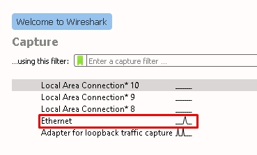

2. Now, open **Chrome or Firefox** and attempt to access any **HTTPs** based Website.
> **e.g.,** `https://www.sophos.com`

3. Go back to Wireshark and observe the packets being captured in the "**Packet List Pane**" as soon as they leave/enter the Ethernet interface.


4. Research and Note down the **Display-Filters** and the respective syntax to quickly highlight and extract the following information:
*	Wireshark Filter **by IP** 
*	Wireshark Filter **by Port**  
*	Wireshark Filter **by IP** and Port 
*	**Mac Address** Filter 
*	Filter **by URL** 
*	**Trace TCP Stream** for website communication 
*	**Filter out** Destination IP address

>**Note:** You can find a useful **cheat list** of Display-Filters here:
> https://packetlife.net/media/library/13/Wireshark_Display_Filters.pdf
 
5. Save the capture in **PCAP format** after validating.


#### .png) You have successfully utilized filters with Wireshark 


***
## **Task 5.3:** <small>Wireshark for Image Capture and Extraction</small> 
Through traffic capture, Wireshark can be used to view and record all information during transit,
if this data is unencrypted such as images flowing to a device, Wireshark will record them and save the traffic information which can be extracted into Jpeg formats to be later collected for forensic evidences.  
In this task, We will browse the internet to an HTTP site while capturing the traffic with Wireshark. We'll then review the captured packets and extract the images which were sent from the website to the London-Client.

>**Note:** Note: In this exercise, you will access external websites, as these websites are
outside of our control, they are subject to change. If you do notice anything is out
of date, please let us know via our support desk so we can implement an update.


1. **Run Wireshark as administrator** and launch a new capture on the **Ethernet** interface.

2. Minimize Wireshark and launch **Google Chrome**. Type into the search bar:
http://zero.webappsecurity.com


>**Note** It is important to access an HTTP site as the information is transmitted in
plaintext.

3. Now, access the article and **browse around the site** to allow **Chrome** to load all the pictures and content. Ideally, it's better if there are plenty of images to view on the page.

4. By now, we should have generated enough traffic flow from the website to the London-Client. Switch back to **Wireshark** and **stop** the traffic **capture**.


5. We also know the IP address of the **London-Client `172.17.17.20`**, and scrolling through the capture, we will see the IP address listed in this capture.
We also see plenty of information about the **HTTP protocol**, and in the **Info tab**, we
can see http://zero.webappsecurity.com. Great, that is the website we used.

6. Now on the top **filter bar**, enter the **Display-Filter** `HTTP` and hit enter.

Initially looking at the capture, we have a lot of information. But we know we were
using **HTTP traffic**. Therefore, within the filter we are presented with
only traffic on this protocol now.The majority of which comes from the **IP address 172.17.17.20**, as this was the main machine accessing the internet.

7. Now click on one of the **HTTP packets**, which has a source address of 172.17.17.20, 
and it begins with the words `GET http://zero.wepappsecurity.com`.

8. Right-click and choose "**Follow > HTTP stream**".


9. Here we see plenty of detailed information about the `GET HTTP` site, the **language**, the
**Host address**, and **cookie information**. Moving down this page, you will see **CSS information** and **font family details**


10. Type the following into the **Find field**: `jpg`
Press Enter to find image details.

11. Here we can see many **jpeg** files on the webpage, and hopefully, we have captured all
those which were viewing in the webpage with **Chrome.**

12. Now we will specifically look for a file called `main_carousel_2.jpg`, but you can
choose any file you like as the process is exactly the same.

>**Note:** You can use the "**Find Next**" button to see the `carousel_2.jpg`

13. Now close the "**Follow HTTP Stream**" box, and in Wireshark go to:
**File > Export Objects> HTTP**. A list of objects captured is shown here.


14. You can either save only the one you are interested in or **save all in a folder**. Let’s save all of them by clicking the "**Save All**" button to the **Documents folder**.

15. After saving the images to the folder, minimize Wireshark.
Go to your File Manager and open up the folder where you saved all files.


15. Here you can see all the objects and **jpeg** files from that http stream of packets, including the **main_carousel_2.jpg file**


>  **Important Note:** If there is no jpeg files extracted you may want to **clear all the browsing data** data in **Chrome** and repeat the process from Step1.


16. Observe and all the files extracted from the **HTTP stream**.


#### .png) You have successfully done Packet Sniffing for Image Capture and Extraction with Wireshark.

***

## **Task 5.4:** Capturing Packets with tcpdump

#### Let's get started with the Linux Desktop:
1. On the "**Remote Desktop Connection Manager**" left pane, 
click on the VM "**03 - Linux Client**" 


2. You'll be presented with the "**Ubuntu Log-in screen**"; At the center of the screen, select the user "**Sophos**" and type the password: `Sophos1985`


>  **Note:** You may want to toggle the "Full-Screen View" in your browser to fit the Linux Desktop in your browser window.


### Let's begin with the Lab:


3. Hoover your pointer to the **Application Dock** on the bottom of the Linux Desktop and launch the **Terminal Emulator**. 


4. To capture packets for troubleshooting or analysis, tcpdump requires elevated permissions, so in the following examples most commands are prefixed with `sudo`.  
To begin, use the command:
```bash
sudo tcpdump -D
```
Or you can use: `tcpdump --list-interfaces` (`-D` for short) to see which interfaces are available for capture.

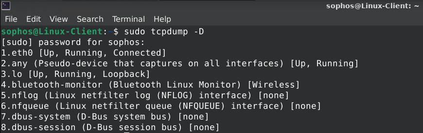
In the example above, you can see all the interfaces available in my machine. The special interface any allows capturing in any active interface.

5. Let's use it to start capturing some packets. Capture all packets in any interface by running this command:

```bash
sudo tcpdump --interface any
```
In the output all the packets captured are shown like this:
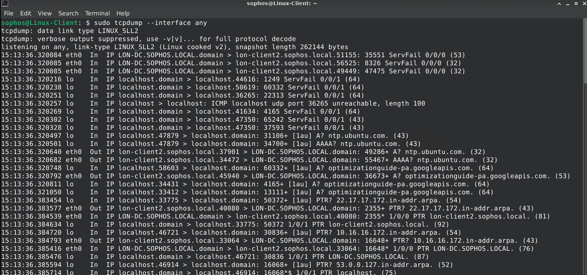

6. Tcpdump continues to capture packets until it receives an interrupt signal. 
Stop the capturing by pressing `Ctrl+C`. 

7. To limit the number of packets captured and stop tcpdump, use the `-c` (for count) option:

```bash
sudo tcpdump -i any -c 5
```
In this case, tcpdump stopped capturing automatically after capturing five packets. 
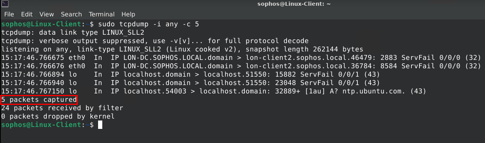

> This is useful in different scenarios, for instance, if you're troubleshooting connectivity and capturing a few initial packets is enough. 

8. By default, tcpdump resolves IP addresses and ports into names, as shown in the previous example. When troubleshooting network issues, it is often easier to use the IP addresses and port numbers; disable name resolution by using the option `-n` and port resolution with `-nn`:
Type the following command:

```bash
sudo tcpdump -i any -c 5 -nn
```
##### Below you can see the two different output with and without name resolution for host-names and port-numbers.
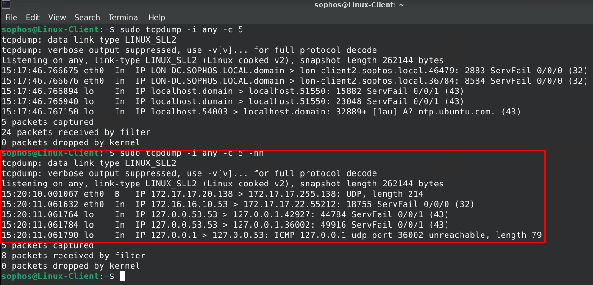

##### One of tcpdump's most powerful features is its ability to filter the captured packets using a variety of parameters, such as s**ource and destination IP addresses**, **ports**, **protocols**, etc..  
Let's look at some of the most common ones.

9. To filter packets based on **protocol**, specifying the protocol in the command line. For example, capture **ICMP packets** only by using this command:

```bash
sudo tcpdump -i any -c5 icmp
```
10. In a different terminal, try to **ping** another machine:
```bash
ping 172.17.17.20
```
Back in the tcpdump capture, notice that tcpdump captures and displays only the **ICMP-related packets**

11. Now, Limit the captures to only packets related to a **specific host** by using the **host filter**:

```bash
$ sudo tcpdump -i any -c5 -nn host example.com
```
In this example, tcpdump captures and displays only packets moving to and from host `example.com`

12. In a different terminal, try to **ping** another machine:

```bash
ping 93.184.216.34
```
In the output you should see that TCPDUMP is only showing packets flowing from **example.com** which resolves into IP address: `93.184.216.34`

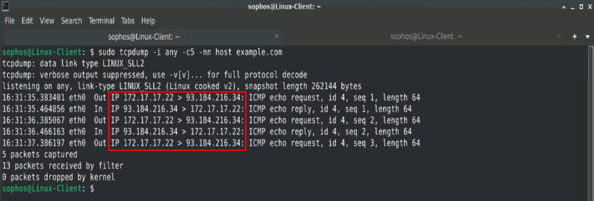


13. Now, let's filter packets based on the desired **service or port**, and **destination IP address**. For example, capture packets related to a web (**HTTP) service** destined to a specific site hosted elsewhere by using this command:

```bash
sudo tcpdump -i any -nn port 80 dst 10.1.1.250
```

14. In the **Applications** Menu, find and launch the Chrome Browser:  
**Applications > Internet > Chrome**

15. Now in **Chrome** navigate into this Blog site:

```bash 
http://10.1.1.250
```

16. Swift back to the terminal and see if TCPDUMP capture other traffic destined to ports and hosts other than the desired port and remote host.

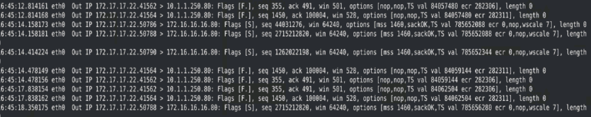

> **Note:** You can also filter by source IP address by using `src` switch instead of `dst` 

##### Another useful feature provided by tcpdump is the ability to save the capture to a file so you can analyze the results later. This allows you to capture packets in batch mode overnight, for example, and verify the results in the morning. It also helps when there are too many packets to analyze since real-time capture can occur too fast.

17. To **save packets to a file** instead of displaying them on screen, use the option `-w` (for write).  
In the terminal type:

```bash
sudo tcpdump -i any -c20 -nn src 172.17.17.22 -w capture.pcap
```
This command saves the output in a file named capture.pcap.   
The **.pcap** extension stands for "**packet capture**" and is the convention for this file format.

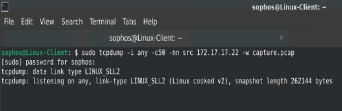
As shown in this example, nothing gets displayed on-screen, and the capture finishes after capturing 20 packets, as per the option `-c20`. 

18. If you want some **feedback** to ensure packets are being captured, use the option `-v`.
Type the following command:

```bash
sudo tcpdump -i any -c50 -nn src 172.17.17.22 -w capture2.pcap -v
```
TCPdump will show how many packets are getting captured and finishes after capturing 50 packets, as per the option `-c50` in this case.


19. Now that you saved the two captures by creating two files in **binary format** (`capture.pcap`, `capture2.pcap`), you cannot simply open it with a text editor.   
To read the contents of the files, you can read and open them by executing tcpdump with the `-r` (for read) option.
Since you're no longer capturing the packets directly from the network interface, `sudo` is not required to read the files, tyoe:

```bash
tcpdump -r capture.pcap
```
Here is the output:
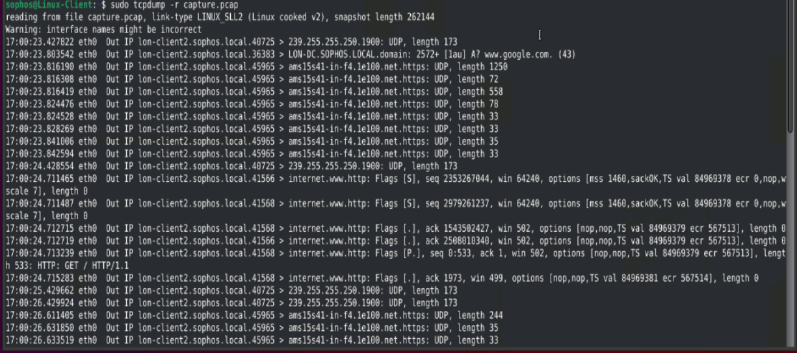


20. A more convenient way to open and read a pcap file generated by tcpdump is using Wireshark instead of tcpdump. Open the second pcap file by launching Wireshark from the terminal:

```bash
wireshark capture2.pcap
```
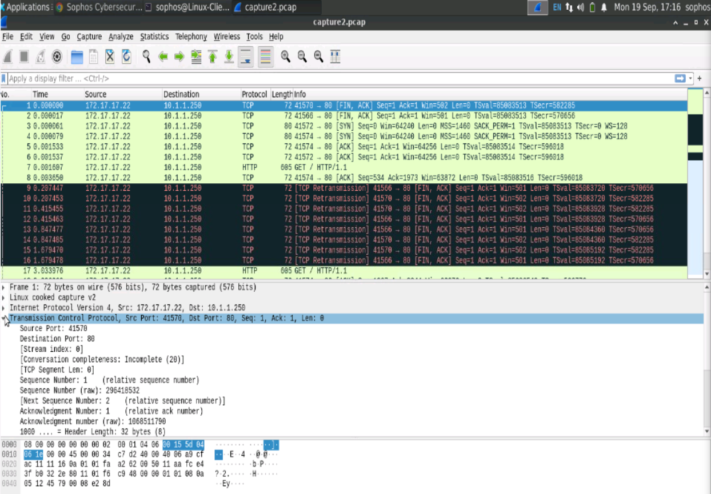

These basic features of tcpdump will help you get started with this powerful and versatile tool. 
To learn more, consult the tcpdump website and man pages:

https://www.tcpdump.org/

https://manpages.debian.org/stretch/tcpdump/tcpdump.8.en.html

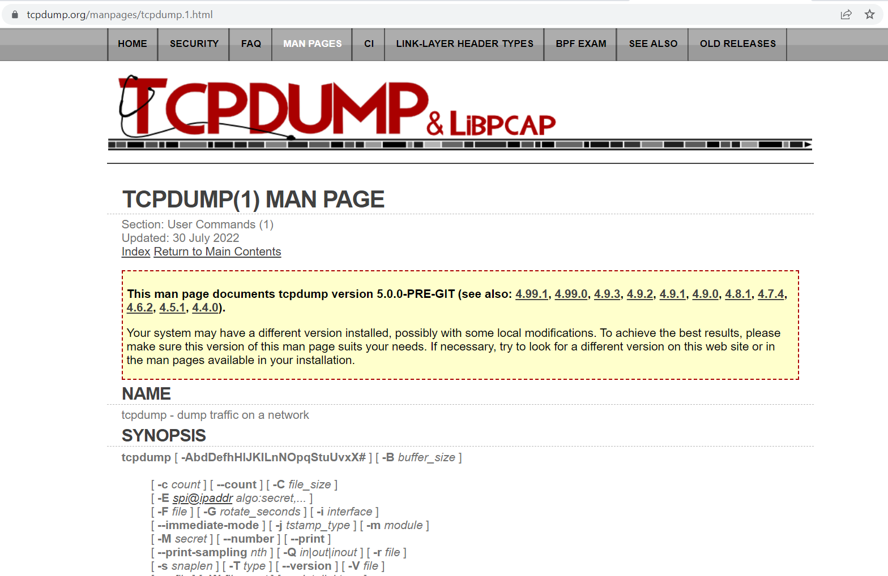

The **tcpdump** command line interface provides **great flexibility** for capturing and analyzing network traffic. If you need a graphical tool to understand more complex flows, Wireshark is the choice.
  
One benefit of Wireshark is that it can read **.pcap** files captured by tcpdump. You can use tcpdump to capture packets in a remote machine that does not have a GUI and analyze the result file with Wireshark, but that is a topic for another day and support course.


***
##  Review  ##

In this Lab you have: 
1.	Understand the uses of the **Process Monitor** Tool  
2.	Utilize **Wireshark** to capture and filter traffic 
3.	Utilize **TCPDUMP** to capture and filter traffic from the command line

***
***
### Before closing this page:
> Please remember to "Deallocate" the "HostVM" in the "Resource Tab" before closing this LAB, 

otherwise please continue to the next LAB.


