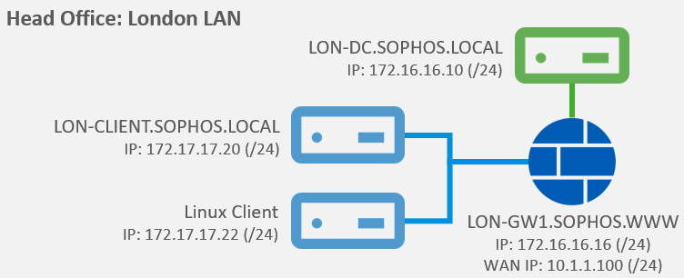
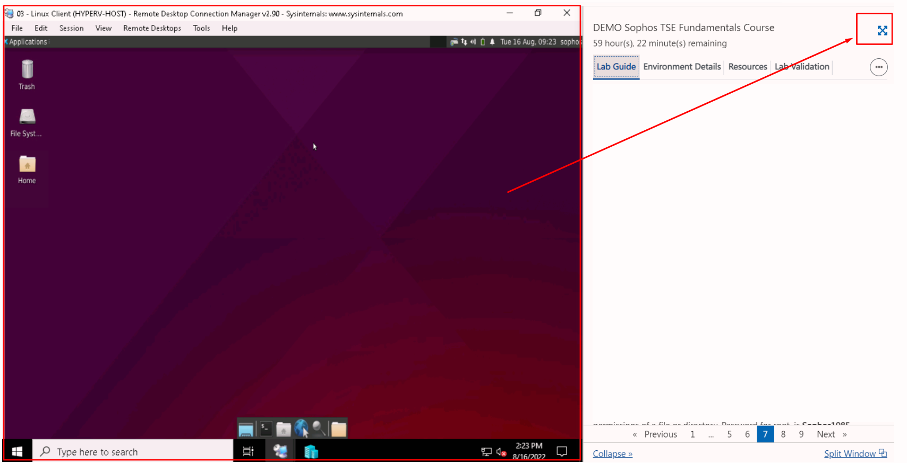

# **Lab 5: Tools**

## Objectives
Upon successful completion of this lab, you will be able to: 
1.	Understand the uses of the **Process Monitor** Tool  
3.	Utilize **Wireshark** to capture and filter traffic 
4.	Utilize **TCPDUMP** to capture and filter traffic from the command line

### Lab Diagram:



***

## **Task 5.1:** Debugging process ID's with Process Monitor Tool

You have been given a task where you need to capture all events i.e., Registry activity, File System activity, Network activity and Thread activity, while accessing a website from Google Chrome. 

#### 
  

1. Double click and open "Procmon64" from the desktop.


2. Open and browse https://www.sophos.com using Google Chrome.

3. On Procmon64 application click on the "Filter" tab on top, apply a filter for all "chrome.exe" processes and all its subtrees.

> **Note:**  You could also apply a similar filter by right-click "chrome.exe" in the list of all captured processes. 


4. Note down all the PID's used by Google Chrome. 

5. Click on File and Save the filtered capture as a PML file.

##### .png) You have successfully debugged using the Process Monitor Tool


***


## **Task 5.2:** Debugging Network activities using Wireshark tool. 

You have been asked to obtain information about active peers in the network from a Wireshark capture.  
Start practicing using the advanced **Wireshark Display-Filters** to quickly analyze and extract valuable information about network traffic.


1. Double click and open "Wireshark" tool from the desktop and start a packet capture from the "Ethernet" interface.


2. Open and browse **https://www.sophos.com** using Google Chrome.

3. Back on the Wireshark application, we can observe the packets being captured in the "**Packet List Pane**" .


4. On wireshark application click on the **Stop** Option below File TAB at the top to stop the log collection.

5. On **"Apply a display filter"** TAB apply the below mentioned filters one by one and press ENTER to filter you logs accordingly. 

```bash
ip.addr == 172.16.16.10
```

> **Note:** This command helps you to filter the wireshark logs based on IP address in general.

```powershell
ip.src == 172.16.16.10
```

> **Note:** This command helps you to filter the wireshark logs based on source IP address.

```powershell
ip.dst == 172.16.16.10
```

> **Note:** This Command helps you to filter the wireshark logs based on destination IP address.

```powershell
tcp.port == 80 || udp.port == 80
```
     
> **Note:** This command helps you to filter the wireshark logs based on traffic in and out from TCP Port 80 and UDP Port 80. (The || means an AND operator on the command). 

> **Note:** You can refer to the below mentioned URL to find other list of filters which can be used for log analysis: https://packetlife.net/media/library/13/Wireshark_Display_Filters.pdf
 
5. Save the capture in **PCAP format** after validating.


#### .png) You have successfully utilized filters with Wireshark 


***
## **Task 5.3:** Image Capture and Extraction using wireshark

Through traffic capture, Wireshark can be used to view and record all information during transit,
if this data is unencrypted such as images flowing to a device, Wireshark will record them and save the traffic information which can be extracted into Jpeg formats to be later collected for forensic evidences.  
In this task, We will browse the internet to an HTTP site while capturing the traffic with Wireshark. We'll then review the captured packets and extract the images which were sent from the website to the London-Client.

>**Note:** Note: In this exercise, you will access external websites, as these websites are
outside of our control, they are subject to change. If you do notice anything is out
of date, please let us know via our support desk so we can implement an update.


1. Double click and open "Wireshark" tool from the desktop and start a packet capture from the "Ethernet" interface.

2. Open ans browse http://zero.webappsecurity.com using Google Chrome or Firefox browser.


>**Note:** It is important to access an HTTP site as the information is transmitted in plaintext.

3. Allow **Chrome** to load all the pictures and content. Browse through the website for sometime.

4. On wireshark application click on the **Stop** Option below File TAB at the top.


5. We know that the IP address of the **London-Client** is **172.17.17.20**, scrolling through the capture we will see the IP addresses listed on the capture. 

6. Find the "Apply a display filter bar" on top of the tool. Enter the Display-Filter as "HTTP" and hit enter.


> **Note:** Initially when looking at the capture, we have a lot of information. But we know we were using HTTP traffic. Therefore, within the filter we are presented with only traffic on this protocol now.The majority of which comes from the IP address 172.17.17.20, as this was the main machine accessing the internet.

7. Right-Click on a **source address** of **172.17.17.20** and click on  "Follow > HTTP stream".

8. Type the following into the **Find field:** **jpg** Press Enter to find image details.


9. We can see many jpeg files on the webpage and we have captured all those which were viewing in the webpage with Chrome.


10. Use the "Find Next" button to locate the carousel_2.jpg.

11. Now close the "Follow HTTP Stream" box and on Wireshark application click on File > Export Objects> HTTP.

12. Click "Save All" option and save the content to Documents Folder.


> **Note:** You can use the "**Find Next**" button to see the `carousel_2.jpg`

13. Open File Manager -> Documents folder.


14. Here you can see all the objects and jpeg files from that http stream of packets, including the main_carousel_2.jpg file.


> **Important Note:** If there is no jpeg files extracted you may want to **clear all the browsing data** data in **Chrome** and repeat the process from Step1.


16. Observe and all the files extracted from the **HTTP stream**.


#### .png) You have successfully done Packet Sniffing for Image Capture and Extraction with Wireshark.

***
1. On the "**Remote Desktop Connection Manager**" left pane, 
click on the VM "**03 - Linux Client**" 


2. You'll be presented with the "**Ubuntu Log-in screen**"; At the center of the screen, select the user "**Sophos**" and type the password: `Sophos1985`



>  **Note:** You may want to toggle the "Full-Screen View" in your browser to fit the Linux Desktop in your browser window.


3. Hoover your pointer to the **Application Dock** on the bottom of the Linux Desktop and launch the **Terminal Emulator**. 


4. To capture packets for troubleshooting or analysis, tcpdump requires elevated permissions, so in the following examples most commands are prefixed with `sudo`.  
To begin, use the command:
```bash
sudo tcpdump -D
```
Or you can use: `tcpdump --list-interfaces` (`-D` for short) to see which interfaces are available for capture.


In the example above, you can see all the interfaces available in my machine. The special interface any allows capturing in any active interface.

5. Let's use it to start capturing some packets. Capture all packets in any interface by running this command:

```bash
sudo tcpdump --interface any
```
In the output all the packets captured are shown like this:


6. Tcpdump continues to capture packets until it receives an interrupt signal. 
Stop the capturing by pressing `Ctrl+C`. 

7. To **save packets to a file** instead of displaying them on screen, 
use the option `-w` (for write).  In the terminal type:

```bash
sudo tcpdump -i any -w capture.pcap
```
This command saves the output in a file named capture.pcap.   

The **.pcap** extension stands for "**packet capture**" and is the convention for this file format.

8. If you want some **feedback** to ensure packets are being captured, use the option `-v` (optional) .
Type the following command:

```bash
sudo tcpdump -i any -w capture2.pcap -v
```

9. Now that you saved the two captures by creating two files in **binary format** (`capture.pcap`, `capture2.pcap`), you cannot simply open it with a text editor.   
To read the contents of the files, you can read and open them by executing tcpdump with the `-r` (for read) option.

Since you're no longer capturing the packets directly from the network interface, `sudo` is not required to read the files, tyoe:

```bash
tcpdump -r capture.pcap
```
Here is the output:


10. A more convenient way to open and read a pcap file generated by tcpdump is using Wireshark instead of tcpdump. Open the second pcap file by launching Wireshark from the terminal:

```bash
wireshark capture2.pcap
```


These basic features of tcpdump will help you get started with this powerful and versatile tool. 
To learn more, consult the tcpdump website and man pages:

https://www.tcpdump.org/

https://manpages.debian.org/stretch/tcpdump/tcpdump.8.en.html


The **tcpdump** command line interface provides **great flexibility** for capturing and analyzing network traffic. If you need a graphical tool to understand more complex flows, Wireshark is the choice.
  
One benefit of Wireshark is that it can read **.pcap** files captured by tcpdump. You can use tcpdump to capture packets in a remote machine that does not have a GUI and analyze the result file with Wireshark, but that is a topic for another day and support course.


***
##  Review  ##

In this Lab you have: 
1.	Understand the uses of the **Process Monitor** Tool  
2.	Utilize **Wireshark** to capture and filter traffic 
3.	Utilize **TCPDUMP** to capture and filter traffic from the command line

***
***
### Before closing this page:
> Please remember to "Deallocate" the "HostVM" in the "Resource Tab" before closing this LAB, 

otherwise please continue to the next LAB.


