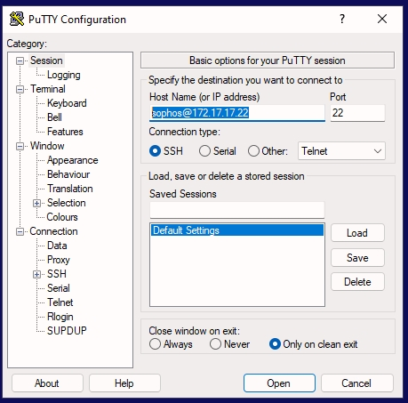

# **Lab 6: Networking**

## Objectives
Upon successful completion of this lab, you will be able to: 
*	Display the routing table from a Windows and Linux client 
*	Configure a DHCP server and observe the various negotiations and behavior in various scenarios. 
*	Lookup and resolve several types of DNS records using nslookup 


### Lab Diagram:


***

## **Task 6.1:** Display and understand routing table
You have been given a task to review the routing table on two clients to validate which interfaces are in use and what path is taken. It was noticed that some clients were getting unresponsive pages and it is suspected there is a potential routing issue. In order to confirm what path is being taken it was advised to investigate the individual routing tables of two problematic clients as the DHCP server was confirmed to be set correctly. 

#### Let's begin:
Login in the London Client with:

|   |   |
|---------|----------|
|User: `SOPHOS\jsmith` | Password: `Sophos1985`|


1. Open a command prompt and type in the following:


```javascript
route print 
```

2. Write down what will be the next-hop to reach the following hosts: 
 
| Host | 	Next Hop |
|------|-------------|
|10.1.40.3 | ? |
|172.17.17.34 | ?	 |
|8.8.8.8 |	?  |

3. Open PuTTY and SSH to the ‘**Linux Client**’ `172.17.17.22`:


|   |   |
|---------|----------|
|User: `sophos` | Password: `Sophos1985`| 

4. After login, run the following command: 
```javascript
ip route
```
also, you can run:
```javascript
netstat -r
```
5. Write down what will be the next-hop to reach the following hosts: 
 
|Host| 	Next Hop |
|----|-----------|
|10.1.40.3 |	 ?|
|172.17.17.34 	| ?|
|8.8.8.8 	 | ?|


##### .png) You have successfully analyzed and understood routing tables on both Linux and Windows. 


***

## **Task 6.2:** <small>Configure a DHCP server</small> 
You have been given a task to set up a new DHCP scope for the network 172.16.16.0/24 on the local domain controller. After creating the relevant scope, you must confirm the DHCP server was correctly responding to the requests, so evidence must be provided of the DHCP resolution.  


 
1. Open a windows command prompt and type in the following: 
```javascript
ipconfig /all 	  
```
> **Note** Ensure interface ‘Ethernet’ is enabled. 

2. Here below is a a screenshoot of the details about the Ethernet adapter `Ethernet`:


> **Note** some values may differ a little in your Lab.

3. Now, Take notes of the interface details of `Ethernet 3`
> **Note:** If no details are shown, it means that Ethernet 3 is not activated.
4. Also, Review the:
>* Autoconfiguration IPv4 Address, 
>* Default Gateway, 
>* Subnet Mask, and 
>* DNS Servers 

5. **Run Wireshark as Administrator** and start a capture on **‘Ethernet 3’** 

> **Note:** In case the `Ethernet 3` is not available you'd need to enable it in:
> `Control Panel > Network and Internet > Network Connections` and restart Wireshark as Administrator.


#### Now, move to another Virtual Machine:


6. Open the Windows **‘Administrative Tools’** from the Windows Start menu and select **DHCP**  
 
7. Under the IPv4 dropdown, right click and **create a new scope**. 
Using the following information: 

> * Name: `Task6` 

> * Description: ***`[Optional]`***
 
>* Start IP address: **172.16.16.1** 
>* End IP address: **172.16.16.50** 
 
>* Subnet mask: **255.255.255.0** 
 
>* Exclusions/Delay: ***[Skip]*** 
 
>* Lease Duration: **8 days** 
 
##### In DHCP Options configure only the following: 
>*	Default Gateway (Router): **172.16.16.16** 
>*	DNS Parent domain: **SOPHOS.LOCAL** 
>*	DNS Servers: **8.8.8.8**  

8. Within Scope [**172.16.16.0**] Task6, select **Scope Options** 

9. then right click and select **Configure Options**.   
Look and familiarize yourself with the available options.

10. Identify and write down 5 different predefined options and their uses.

#### Moving back to the previous Virtual Machine:
 

 

11. Open up **Wireshark** and filter for the **DHCP traffic only**. Open each packet in the DHCP sequence to be familiar with each type of packet's being requested. 
 
###  **D.O.R.A.** request: 
> * **Discovery** – Client sending Broadcast
> *	**Offer** – Server sending a reply
> *	**Request** – client requesting ip Broad
> *	**ACK** – From server


12. Write down what the server replied with for **Option 51**, **Option 6**, and **Option 54**: 

|           |                                  |
|----------|------------------------------------|
| Option 51 |	e.g., *IP Address Lease Time – 8Days* |
|Option 6 |e.g.,	*Specify the DNS Server 8.8.8.8*|
|Option 54 |e.g.,	 *Specify IP DHCP Server Identity*|

 
13. Write down the source IP, destination IP, source mac address and destination mac address of the DHCP Request: 
 
|           |                                  |
|----------|------------------------------------|
|Source IP|         	?|
|Destination IP 	|             ?|
|Source MAC Address |           	 ?|
|Destination MAC Address |              ?|

 ***
###  Why are these addresses used? 

> `0.0.0.0`	means “any” or “unassigned”, since the source mac address (client) does not have an associated/configured IP address.

‌‌ 

> `255.255.255.255` It floods a DHCP Request message over the IP network using a broadcast IP address (255.255. 255.255) in order to deliver the DHCP Request message to all the DHCP servers on the same subnet

‌‌ 

> `Source Mac Address` – The Mac address of the client looking to get an ip assigned by any available DHCP server in the broadcast domain.

‌‌ 

> `ff-ff-ff-ff-ff-ff` or `Destination MAC Address` – A frame with a DHCP discovery/request is delivered and flooded to all available devices in the network (broadcast), in hope that a DHCP will reply and acknowledge the request for ip assignment. 

***
Now, moving back to the London Client:

13.	Enable or/and Disable the interface **‘Ethernet 3’** 


14. in **cmd prompt** type: 
```bash
netsh interface show interface
netsh interface set interface “Ethernet 3” disable/enable
```
 ‌‌ 
  
15. or with **PowerShell** type:
```Powershell
get-net-adapter
Disable-Netadapter -Name “Ethernet 3”
Enable-NetAdapter -Name "[your adapter name]"
```
 ‌‌ 

16. or with the Control Panel:
**Control Panel > Network and Internet > Network Connections**


 **Tip:** here is a useful link:  
https://winaero.com/disable-network-adapter-windows-10


##### .png)  You have now successfully analyzed DHCP requests and created a DHCP scope 

***

## **Task 6.3:** <small>Lookup and resolve several types of DNS records using nslookup </small> 

You have been given a task to display the routing table on two clients to validate which interfaces are being used. This must be verified on both **London Client** and **Linux Client**. 

##### First, in the London-Client:


1. **Run Wireshark as administrator** and launch a packet capture on ‘**Ethernet**’ interface. 
 
2. Open a command prompt and experiment with the DNS queries listed below using **nslookup** utility: 
 
|  Destination |	Record Type | 	Query Used      |
|----------|------------------------------------|
| sophos.local |	A |	 Nslookup -type A Sophos.local |
| sophos.local using DNS 8.8.8.8 |	A 	| Nslookup -type A 8.8.8.8 |
| sophos.com |	TXT 	 | Nslookup -type TXT Sophos.com |

3. **Stop** the **Wireshark** capture and run a **Display-filter** to display only **DNS queries**

4. Which DNS server was used to query **sophos.com** for `txt` records? 
 
> Server: **LON-DC-SOPHOS.LOCAL**

> Address: `172.16.16.10`

#### Why was this DNS server used? 
The first available DNS holding the information, however it is a Non-Authoritative DNS server for the zone.
 
 
 
 
5. What server provided the authoritative answer that sophos.local is not responsible when using DNS 8.8.8.8? 
When querying: 
 ```bash
 Nslookup -type=soa dns.google
 ```
Querying the non authoritative ns1.zdns.google:
```bash
Nslookup -type=soa ns1.zdns.google
```
The answer comes from:    
 ```bash
 dns.google
 ```
 
##  What does this mean? 
 
 An authoritative answer is when the DNS server hosting the primary copy of the DNS record responses to your lookup. 
 When nslookup provided results by a server that is not the authoritative (primary) source. Typically, this means the result was provided by a server  that held a cached copy of the DNS record. This is important because the DNS record may have been changed recently and the cached copy may not reflect the most up-to-date information.


See more information here:
https://www.meridianoutpost.com/resources/articles/command-line/nslookup.php#AuthoritativeResponse
 
 
 
##### .png) You have now successfully made various DNS request types and analyzed their packets. 


***

##  Review  ##

You have now successfully: 
1.	Displayed the routing table from a Windows and Linux Client  
2.	Configured a DHCP server and observed the various negotiations and behavior 
3.	Looked up and resolved several types of DNS records using nslookup 

***
***
### Before closing this page:
> Please remember to "Deallocate" the "HostVM" in the "Resource Tab" before closing this LAB, 

otherwise please continue to the next LAB.


