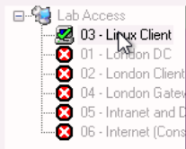

# **Lab 7: Linux**

## Objectives
Upon successful completion of this lab, you will be able to: 
* Create, copy, move, and rename files
* Manage file and folder permissions
* Make edits to files using the text editor vi
* Search through files using the text editor vi
* Search through system files using various grep commands


### Lab Diagram:


***

## **Task 7.1:** Create, copy and rename a file before managing permissions
You have been given a task to create two separate directories with two identical files. However, one file, ‘**file1b.log**’ requires different permissions than the original file. The ‘**file1b.log**’ requires file owner full permissions, the ‘**games**’ group read and execute permissions, and all others execute permissions only.  

#### Let's get started with the Linux Desktop:
1. On the "**Remote Desktop Connection Manager**" left pane, 
click on the VM "**03 - Linux Client**" 



2. You'll be presented with the "**Ubuntu Log-in screen**"; At the center of the screen, select the user "**Sophos**" and type the password: `Sophos1985`


>  **Note:** You may want to toggle the "Full-Screen View" in your browser to fit the Linux Desktop in your browser window.


### Let's begin with the Lab:


1. Hoover your pointer to the **Application Dock** on the bottom of the Linux Desktop and launch the **Terminal Emulator**. 


2. Navigate to the `/var` directory with `cd` command and attempt to **create two directories** named `task7a` and `task7b`.

> **Note:** You will receive an error ‘**Permission denied**’.


3. To Set the proper permissions to **allow** the user ‘sophos’ and all others to write in the `/var` directory you will be using the `chmod` command

```csharp
Chmod 773 /var
```
>  **Note:** You must login as the file owner or root user to modify the permissions of a file or directory. The Password for **root** is `Sophos1985`
You could simply elevate your shell typing: `sudo` before the command.  
**e.g.,** `sudo chmod xxx /directory` 


4. Write down the **alternative chmod command(s)** you could use to give sufficient permissions to the `/var` directory.

> **Hint:** You previously used the **"Absolute Form"** with `chmod`, you could now try to achieve the same results using the **"Symbolic form"**.   
see here: https://kb.iu.edu/d/abdb#change


5. Now, that we have the proper permission, attempt to create the **two directories** in the same parent `/var` directory: 

```csharp
 mkdir task7a task7b
```
> **Note:** Make sure you are in the /var Directory.

6. As the user ‘sophos’, **create a file** in `/var/task7a/` named: `‘file1.log’`  
with the following content: 

```csharp
This content is from file1   
This is line 2
```
Try to perform this step as efficient as possible

> **e.g.,** You could you use one line command:

```csharp
echo -e “This content is from file1\nThis is line 2” > task7a/file1.log
```
> **Note:** `\n` Indicates to write in a new line.

7. Create a copy of `/var/task7a/file1.log` and save it to `/var/task7b` 
Then rename the `/var/task7b/file1.log` to `file1b.log`

> **e.g.,** In the `/var directory`, You could you use one line command:

```csharp
cp task7a/file1.log task7b/ && mv task7b/file1.log task7b/file1b.log
```

8. Write down the command(s) used to copy the file;
9. Write down the command(s) used to rename the file;

10. Set the permissions of the file `‘file1b.log’` to the following parameters: 


>**Note:** To modify the file you must elevate your shell with `sudo` or login as the file owner or group owner. 

11. Write down the command(s) used to set the permissions of `file1b.log` 
 

##### .png) You have successfully created, copied, renamed, and modified file permissions. 


***

## **Task 7.2:** <small>Make Edits and searches using **`vi`**</small> 
You have been given a task where the administrator requires you to add additional lines to the file `/var/file1b.log` to diagnose an issue. It was suggested to use the **vi text editor** as there is no GUI on the Linux machine.   
Once complete, you must then search the file using a string and make a final line edit.  

#### Move back to the London Client Windows Machine:
 

1. Open PuTTY and SSH to the **Linux Client**: `172.17.17.22`
as the **user** `sophos` and **password** `Sophos1985`

2. Append the following lines to the bottom of `/var/file1b.log` using **vi** and save the file, **respecting the case sensitivity**: 

```csharp
This is Line 3 
 This is LINE 4 This 
 is line 5
```

3. While still in the **vi** text editor, press the keys `Ctrl+c` and type `/line` to run a search within the file and hit enter. 

4. Note the highlights in the text you typed in the file.  
The searches are all sensitive and only line with the exact string match will be shown.

5. Try other searches with different Case matches, observe and take note of the cursor position. 

>  **Note:** The **vi** text editor has various mode, to type into a file you will need to use the **"Entry mode"** by combining the following keys: `Alt + I`.
> To exit and save the file you will need to use the **"Command mode"** by combining the the `Ctrl+c` keys. Find out more about these modes here: https://www.redhat.com/sysadmin/introduction-vi-editor

 
6. Edit line 1 using **vi editor** and change the first line to: 

```csharp
This content is from file1b.log
```

 
7. Write the changes and quit **vi editor** with `Ctrl+c` and type `:wq!` and hit enter.
> **Note:** `:wq!` tells the **vi editor** to **Write** and **Quit**.

8. Confirm the changes were successfully made and have been saved with the following command:

```bash
cat /var/file1b.log
```

##### .png) You have successfully appended lines, searched, and made file content updates using vi. 

***

## **Task 7.3:** <small>Search using various **`grep`** commands through system files </small> 
You have been asked to gather all system logs for an event on January 22nd. The issue was reported at 7:15 AM but to ensure all the relevant logs are collected, you were tasked to gather everything that occurred on between 0700 and 0759. Understanding that it is your first-time searching content, your manager has provided you with a series of grep commands for practice. 


#### Using the same London Client VM:
](JPG/London%20Client.png)

1. Open PuTTY and SSH to the **Linux Client**: `172.17.17.22`
as the **user** `sophos` and **password** `Sophos1985`

2. Through the terminal, navigate and change directory to `/var/task7b` 

3. Run the following commands and take note of the different output from each: 
 
```csharp
grep 'line 4' file1b.log
```
> **Output:** None, grep is case sensitive!	
 	
```csharp
grep -i 'line 4' file1b.log
```

> **Output:** `-i` tells grep to skip case sensitive search in arguments

```csharp
grep -v 'line 4' file1b.log
```

> **Output:** the search for everything else excluding the matching argument. case/string

```csharp
grep -e 'line' -e 'LINE' file1b.log
```

> **Output:** Show multiple matching searches in one command.	
 
	
4. Run a search to find all the files named `syslog` with:
```bash
find / -type f -name syslog* 2>/dev/null
```
> **Note** `2>/dev/null` It prevents from showing too many errors in the search that could overpopulate your terminal. 

5. In your **search output** there should be a `syslog.tar` archive containing some relevant log files necessary for the next step. 

**Extract** or **"Untar"** **the content of the archive** in the Documents directory using the following command:

```bash
tar -xvf </var/archive name> /home/sophos/Documents
```
6. Now within the terminal, navigate where you extracted the files and **perform a search** using the **grep** command to find all the syslog messages that occurred on **22 January at the 7th hour**. Send this output to a file called `syslogJan22.log` by typing the following command:
```csharp
grep “Jan 22 07:[0-5][0-9]:[0-5][0-9]" <file or directory location> > syslogJan22.log
```
> **Note the syntax:** `[0-5][0-9]` indicates to include all the possible matches in the time spawn of 59 minutes and 59 seconds, which corresponds to exactly 1 hour between 07:00 to 08:00.

7. Confirm this file only contains syslog messages between 7 AM to 8 AM on Jan 22nd only.  

> **Hint:** Use `cat` to quickly inspect the content of `syslogJan22.log`:  

‌ 

#### .png) You have now successfully searched files using grep and saved search results to a file. 

***

##  Review  ##

You have now successfully: 
1.	Created, copied, moved, and renamed files 
2.	Managed file and folder permissions 
3.	Made edits to files using text editor vi 
4.	Searched through files using text editor vi 
5.	Searched through system files using various grep commands 

***
***

### Before closing this page:
> Please remember to "Deallocate" the "HostVM" in the "Resource Tab" before closing this LAB, 

otherwise please continue to the next LAB.


