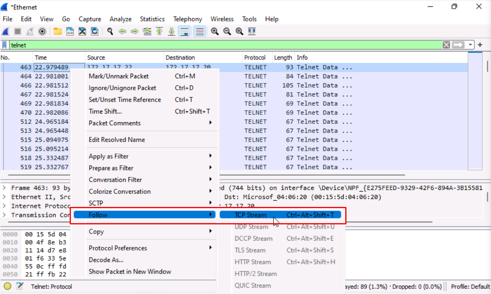

# **Lab 8: Cryptography**

## Objectives
Upon successful completion of this lab, you will be able to: 
 
* Understand the difference between the connection to an untrusted site and to a trusted site.
* Verify if a certificate is trusted in Windows (Computer?)
* Create a trust with a Private CA.
* Generate a Certificate Signing Request (CSR) 
* Packet Sniffing for Passwords

### Lab Diagram:

***

## **Task 8.1:** Analyze the difference between the connection to an untrusted site and to a trusted site. 
SSL/TLS certificates can be divided into trusted and untrusted, based on the issuing certification authority. The importance of using a certificate from a trusted certification authority lies in the completely error-free use of the certificate in users' browsers and an incomparably higher level of trust and authentication.  
In this exercise, you are tasked with understanding and learning what requirements a certificate must meet to be valid.


### Let's begin:

1. Login in the London Client as "jsmith":
* User: `SOPHOS\jsmith`
* Password: `Sophos1985`

2. Open **Google Chrome** and navigate to: 
```csharp
https://expired.badssl.com/
```

3.	Note down the **warning** being received and hit **"Advanced"**:
 
4.	Click on Not secure and write down the reason for the certificate warning.


5.	Write down the:

* **signature algorithm**, 
* **expiration date** , and 
* **how many bits** were used for the signing CA of **“*.badssl.com”**

6.	Click Proceed to **expired.badssl.com** (unsafe)


7.	Now, open another tab in Google Chrome and type 
```csharp
https://sophostest.com/
```

8.	Click on the **Padlock** -> **Connection is secure** -> **Certificate is valid**


9.	Write down the **CA** that issued the certificate.

10.	Verify the **purpose**, **validity**, and **version** of the certificate.

11.	Out of the both the sites,  assess which of the two gets a **Trusted/Untrusted Connection**: 


* `Trusted Connection`:

* `Untrusted Connection`: 

---

## **Task 8.2:** Verify if a certificate is trusted in Windows.


1. Connect to the **London Client**:
* User: `SOPHOS\jsmith`
* Password: `Sophos1985`


2.	Click **Start** > **Run**, type `MMC` and then press Enter.

This will launch the "**Management Console**", which provides system administrators and advanced users with an interface for configuring and monitoring the system with administration tools called "**snap-ins**."

3.	On the File menu, click **Add/Remove Snap-in**.

4.	Select "**Certificates**", click **Add**, select "**My user account**", and then click **Finish**.

5.	Select "**Certificates**", click **Add**, select "**Computer account**", and then click **Next**.

6.	Select **Local computer** (the computer this console is running on), and then click **Finish**.
](JPG/Console3.jpg)
7.	On the "**Add or Remove Snap-ins**" click **OK**.

8. Click File > Save > Desktop > CertificateConsole.msc

9. Click Save


10. Minimize the  Console, 

11. Open the browser and type this URL: **https://sophos.com/**

12. Note the Root CA for **https://sophos.com/**

13. Go back to the Certificate Console, 

14.	Expand **"Certificates - Current User"** in the management console, 

15. Browse on **Trusted Root Certification Authorities > Certificates** 


16. Note down the root CA for **https://sophos.com/** _____________________________________________________

17. Repeat the steps to verify if the root CA is also added in the "Trusted Root Certification Authorities" in the Certificates (local computer) 

#### .png) You have successfully verified if a certificate is trusted in Windows 


***


## **Task 8.3:** Create a trust with a Private CA.

In this scenario, you have been assigned to use the Domain Controller as a trusted private certification authority, so that all its certificates issued are automatically trusted by the client.

1. Login in the London Client as "**jsmith**":
* User: `SOPHOS\jsmith`
* Password: `Sophos1985`


2.	Open Google Chrome and type the following URL: 
```bash
https://lon-dc.sophos.local/certsrv . 
```
3. The browser will show you the Privacy error:


4.	What does this error mean? 
 ____________________________________________


5.	How can we resolve this error?
 ____________________________________________


6.  H3
0


6.	Use Google Chrome to create the trust with  **SOPHOS-LON-DC-CA** Certificate Authority for the User account and Computer account. To connect, use the following link: 
```bash
https://lon-dc.sophos.local/certsrv
```

7.	Use the MMC console and verify that **SOPHOS-LON-DC-CA**, is trusted for both the **User Account** and **Computer Account**. 

8.  Close all the open windows except the MMC console.

#### .png) You have successfully established a trust with a Private CA and Google Chrome Browser. 


***


## **Task 8.4:** Generate a CSR using OpenSSL to prepare a certificate
You have been tasked with creating a new certificate using the company's CA, which will be used in the future deployment of a web server. The private key must be saved and password protected.

### Moving back to the Domain Controller VM:


1. Use **openssl.exe** through Windows command prompt to generate a **CSR**.  
> **OpenSSL** is in C:\Users\Administrator\Downloads\OpenSSL\bin\openssl.exe 

 
2. Use the following command with **openssl.exe** to generate a **CSR** and **private key pairing**. Fill in the requested fields with the information of your choosing: 

```csharp
req -new -newkey rsa:4096 -nodes -keyout private.key -out certificate.csr
```
> The **private key** is generated during CSR creation. Treat this **like a password**. Take note of the `.csr` and `.key` location for future use. 

3. Open the "**certificate.csr**" file with **Notepad++** and leave it open.


4. Now, open **Google Chrome** and navigate to:  
```csharp
https://localhost/certsrv/
```
Although the warnings, proceed further into the page.

> **Note:** We are accessing a certificate Authority to generate a certificate. In our case the CA is the London-DC

4. From "**Select a task**", Hit **"Request a certificate"** 
 
5. Go to ‘**Advanced certificate request**’ and **copy/paste** the contents of the `certificate.csr` file you have opened with **Notepad++**.


6. **Submit** and take note of the **Request ID**: 


7. Minimize Google Chrome and Notepad++ and from the **Windows Administrative Tools**, launch the ‘**Certification Authority**console’, and find the newly requested certificate under ‘**Pending Requests**’.  

8. Select the certificate and right click and select **All Tasks > Issue** 


9. Now, the certificate are accepted and moved under the **Issued Certificates**, in here find the new certificates. 


9.	Switch to **Google Chrome** and click Home.
10.	Click on "**View the status of a pending certificate request**".
11.	Click **Saved-Request Certificate Link**.
12.	Download and install the certificate for the current user 
13.	Use the **MMC** and verify that the certificate is installed for the current user.
14.	Write down where the information in the newly generated certificate came from.
15.	Who is the issuer of the certificate?
16.	How was the issuer decided?
17.	Switch to Google Chrome and hit **Home**.
18.	Click on **Download a CA certificate, certificate chain or CRL**.
19.	Click on **Install CA Certificate** to trust certificates from this **CA**.


### .png)  You have created a CSR and certificate pair 


***
## **Task 8.5:** Packet Sniffing for Passwords

Many protocols display information in plaintext which is not a secure method for
transmission. Telnet is one of the primary communication and application protocols
used for establishing a connection to any enabled computing device. Most Routers,
Switches, and Servers will have this function. However, that doesn’t mean it’s been
enabled.
In this task, we will be sniffing out traffic crossing the network and primarily looking
for the telnet password.
Now a quick recap, Telnet is an application layer TCP/IP protocol which connects to
telnet services. Where a telnet application is listening it operates on port 23.


#### Let's get back on the London-Client:


1. Launch **Wireshark as administrator** and have it begin listening to traffic on the **Ethernet** interface.


#### Move to the Linux-client:

1. On the "**Remote Desktop Connection Manager**" left pane, 
click on the VM "**03 - Linux Client**" 


2. You'll be presented with the "**Ubuntu Log-in screen**"; At the center of the screen, select the user "**Sophos**" and type the password: `Sophos1985`


>  **Note:** You may want to toggle the "Full-Screen View" in your browser to fit the Linux Desktop in your browser window.


3. Once login, move your pointer to the **Application Dock** on the bottom of the Linux Desktop and launch the **Terminal Emulator**. 


4. In the terminal, initiate a Telnet connection to the London-Client by typing the following commands:

```bash
telnet 172.17.17.20
```

5. Use the following credentials and hit enter.  
As we enter the Username and then the password, it might take a few
moments for the credentials to be authenticated so be patient.
> * User: `sophos` 
> * Password: `Sophos1985`

6. You should be now greeted with the **Windows cmd prompt** of the remote **London-Client**.

Close the Linux Terminal and move back to the **London-Client**


7. Now let’s **stop Wireshark** to capture any further packets by clicking on the **Red Square icon**.

Once again there is a lot of information and before we learned that **telnet** operates on **Port 23**
and it was a **TCP/IP protocol**.

8. With this information let's set the appropriate **Display-filter** by simply typing `telnet` into the filter-bar and hit enter.

This will single out the traffic for telnet protocol only.

9. Right-click any of the **TELNET** packet and **Follow the TCP stream**.

This will collect the stream together and present the output of those packets.

10. We can clearly see really important details here that were transmitted in plaintext.
First, we can confirm that Telnet Service was being used. It literally says this in the
read out of the Wireshark Top Pane. Further more the Login information under user `sophos` and the Password `Sophos1985` was captured.

In fact, were we to continue using Wireshark we could record every action the
user `sophos` or even an administrator takes on the network so longing as he/she uses telnet!!

#### This is a small demonstration to understand how important **encryption** is in today's communications.  
Telnet should be used strictly in isolated and secured networks and **never to be used** for remote connections over public networks like the **Internet**.
**SSH** or **MOSH** is a great and **secure alternative** to Telnet, for users who need access to remote servers over untrusted networks.  

#### .png) You have used Wireshark to sniff and capture unencrypted HTTP traffic.


***

##  Review  ##

You have now successfully: 
* Understood the difference between the connection to an untrusted site and to a trusted site.
* Verified if a certificate is trusted in Windows (Computer?)
* Created a trust with a Private CA.
* Generated a Certificate Signing Request (CSR) 
* Packet Sniffing for Passwords


***
***
### Before closing this page:
> Please remember to "Deallocate" the "HostVM" in the "Resource Tab" before closing this LAB, 

otherwise please continue to the next LAB.


