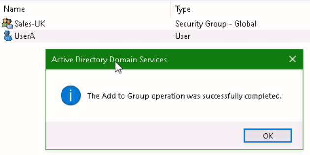
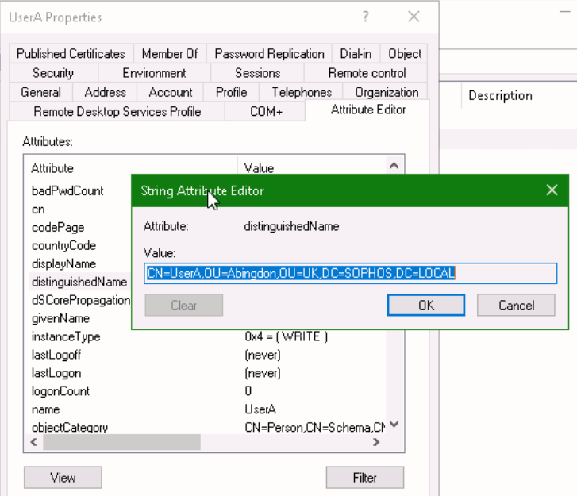

# **Lab 3: Active Directory**

## Objectives
Upon successful completion of this lab, you will be able to: 
1.	Create OUs, groups, and users in Active Directory 
2.	Modify and identify both user and group attributes 

***

### Lab Diagram:

***

## **Task 3.1:** OU, Group and User Configuration 

You have been assigned a task to create **Users**, **Groups** and an **OU's** in Active Directory: 
  

Logon on London-DC using the following:

Username: **administrator**

Password: **Sophos1985**

1. From the **Server Manager > open the **Active Directory Users and Computers** console

2. Right-click `SOPHOS.LOCAL`, and select **New** > **Organizational Unit** with following names ( create all three Ou's):
>* `UK` 
>* `Canada`
>* `India`

 
 

3. Using the same steps above, under the previously created **OUs**, create three new **sub-OUs** with the following names:
  
| OU | Sub-OU   |
|----|----------|
| UK | `Abingdon` |
|Canada| `Vancouver` |
| India | `Ahmedabad` |

4. Now, create two **users** in each **sub-OU**:
 
| OU |	User  |
|----|--------|
| Abingdon | `UserA`, `UserB` |
| Vancouver |	`UserC`, `UserD` |
| Ahmedabad |	`UserE`, `UserF` |
> **Note:** leave the password field empty and press **Finish** to create the user

5. Create the Group "**Sales-UK**" in the "**Abingdon OU**" 

6. Right-click "**UserA**" and select **"Add to a group..."**    
Type `Sales-UK` in the search box and confirm with **"Check Names"**

7. Press **OK** twice; a confirm prompt should appear:

8. Use the same steps above to create another Group "**Finance**" in the "**Ahmedabad OU**" and add "**UserF**" to it.

9. Leave the "**Active Directory Users and Computers**" console open for the next Task.

#### .png) You have successfully created OUs, Users, and Groups in Active Directory

***

## **Task 3.2:** <small>Verify attributes of Active Directory Objects</small> 
In this task, you will be verifying the attributes of Active Directory Objects.

  
1. List the **distinguished name** for **‘UserA’** and **‘UserD’**.

***
####  How to find the **"distinguishedName"** of an **OU**:

> a) In the "**Active Directory Users and Computers**" console, select **View > Advanced Features**.

> b) Click on  the Abingdon OU, **Right-Click** the UserA and then select **Properties**.
> c) In the Properties, select the **Attribute Editor** tab.   
> d) Click on **distinguishedName** to highlight it, then click **View**
> Example: 
***

2. Write down the **Mail**, **UserPrincipalName** and the **sAMAccountName** attribute for user ‘**Jane Doe**’:
3. Write down the displayName, GroupID and **Common Name** for user ‘**Lucy Fox**’
4. Write down the **objectGUID** and **Distinguished name** for group ‘**Sales**’
5. You can now close down the **"Active Directory users and Computers"**

##### .png) You have successfully verified user and group attributes 

***

##  Review  ##

You have now successfully: 
* Created OUs, groups, and users in Active Directory 
* Modified and identified both user and group attributes 

***
***
### Before closing this page:
> Please remember to "Deallocate" the "HostVM" in the "Resource Tab" before closing this LAB, 

otherwise please continue to the next LAB.

