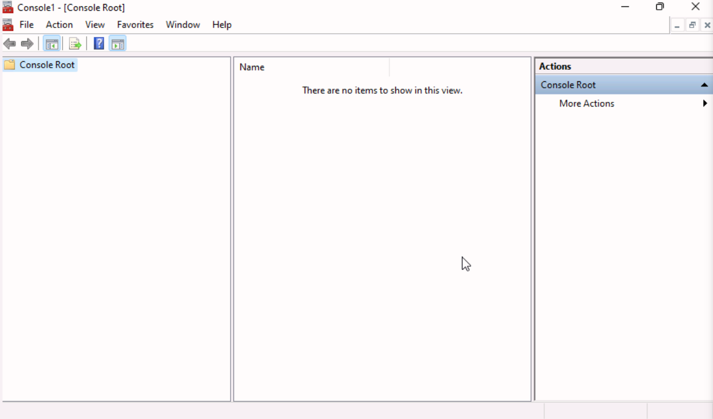
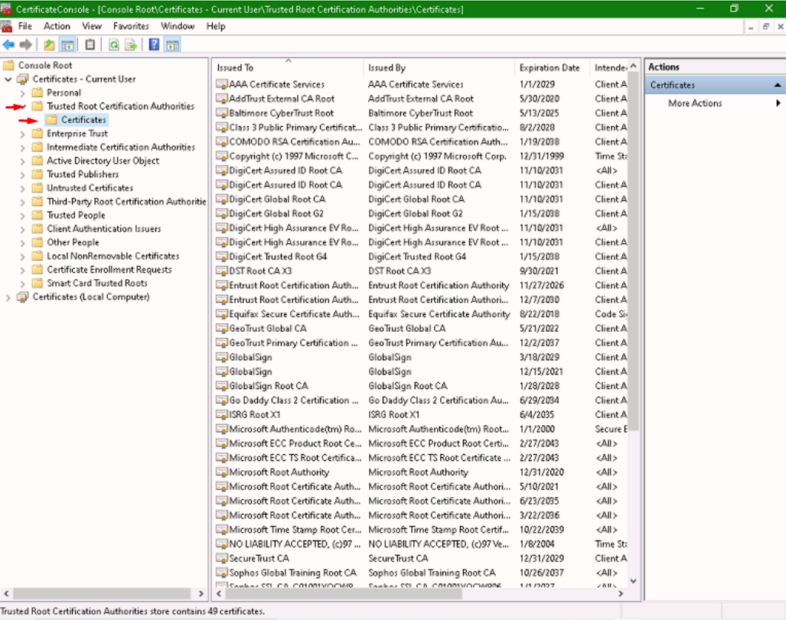
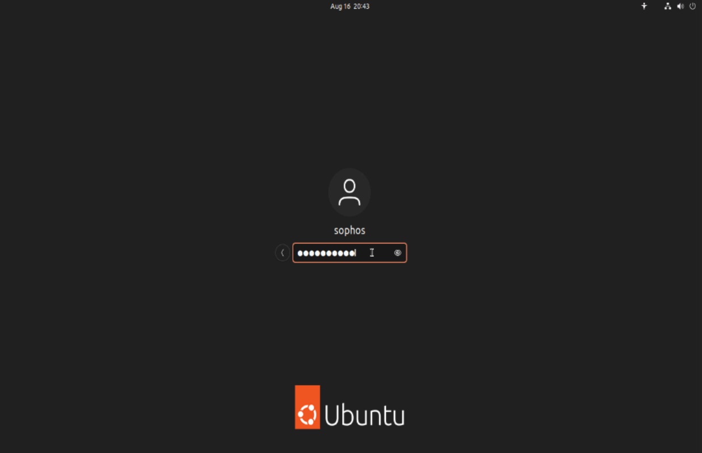

# **Lab 6: Cryptography**

## Objectives
Upon successful completion of this lab, you will be able to: 
 
* Understand the difference between the connection to an untrusted site and to a trusted site.
* Verify if a certificate is trusted in Windows
* Create a trust with a Private root CA.
* Packet Sniffing for Passwords

### Lab Diagram:

***

## **Task 6.1:** Analyze the difference between the connection to an untrusted site and to a trusted site. 
SSL/TLS certificates can be divided into trusted and untrusted, based on the issuing certification authority. The importance of using a certificate from a trusted certification authority lies in the completely error-free use of the certificate in users' browsers and an incomparably higher level of trust and authentication.  
In this exercise, you are tasked with understanding and learning what requirements a certificate must meet to be valid.


### 

 Connect to the **London Client**:
>  User: `SOPHOS\jsmith`
>  Password: `Sophos1985`


1. Open **Google Chrome** and navigate to: 
```csharp
https://expired.badssl.com/
```

2.	Note down the **warning** being received and hit **"Advanced"**:
 
3.	Click on Not secure and write down the reason for the certificate warning.


4.	Verify the following details on the certificate:

* **Certificate Signature Algorithm** 
* **Validity**
* **Subject's Public Key**  

5.	Click Proceed to **expired.badssl.com** (unsafe)


6.	Now, open another tab in Google Chrome and type 
```csharp
https://sophostest.com/
```

7.	Click on the **Padlock** -> **Connection is secure** -> **Certificate is valid**


8.	Write down the **CA** that issued the certificate.

9.	Verify the following details on the certificate:

* **Certificate Signature Algorithm** 
* **Validity**
* **Subject's Public Key**

10.	Which of the two sites can be considered a secure and unsecured connection?


* `Trusted Connection`:

* `Untrusted Connection`: 

11. Close all open Windows.

---

## **Task 6.2:** Verify if a certificate is trusted in Windows.
In this exercise, you will learn how to verify how certificates and CA are trusted on a Windows Endpoint.


 Connect to the **London Client**:
>  User: `SOPHOS\jsmith`
>  Password: `Sophos1985`

1.	Click **Start** > **Run**, type `MMC` and then press Enter.

This will launch the "**Management Console**", which provides system administrators and advanced users with an interface for configuring and monitoring the system with administration tools called "**snap-ins**."

2.	On the File menu, click **Add/Remove Snap-in**.

3.	Select "**Certificates**", click **Add**, select "**My user account**", and then click **Finish**.

4.	Select "**Certificates**", click **Add**, select "**Computer account**", and then click **Next**.


5.	Select **Local computer** (the computer this console is running on), and then click **Finish**.
](JPG/Console3.jpg)

6.	On the "**Add or Remove Snap-ins**" click **OK**.

7. Click **File > Save > Desktop > CertificateConsole.msc**

8. Click **Save**


9. Minimize the  Console, 

10. Open the browser and type this URL: 

```bash
https://sophos.com/
```


11. Note the Root CA for **https://sophos.com/**

12. Go back to the Certificate Console, 

13.	Expand **"Certificates - Current User"** in the management console, 

14. Browse on **Trusted Root Certification Authorities > Certificates** 


15. Try to locate the Root CA Certificate of **https://sophos.com/** (Noted in step 11) 
> Note: Since the Root CA certificate is in the Trusted Root Certification Authorities store, the certificates issued by that CA are automatically trusted. 

16. Repeat the steps to verify if the root CA is also added in the "**Trusted Root Certification Authorities**" in the Certificates (local computer) 

#### .png) You have successfully verified if a Certificate Authority  is trusted in Windows Endpoint. 


***


## **Task 6.3:** Create a trust with a Private CA and the user.

In this scenario, you have been assigned to use the LON-DC as a trusted private Certificate Authority, so that all its certificates issued are automatically trusted by the client.


 Connect to the **London Client**:
>  User: `SOPHOS\jsmith`
>  Password: `Sophos1985`

1.	Open **Google Chrome** and type the following URL: 
```bash
https://lon-dc.sophos.local/certsrv
```
2. The browser will show you the **Privacy error**:


3. Now click "**Not secure**" > **Certificate is not Valid** >


4. Note down the fields for: 
* `"Issued to"` 
* `"Issued by"`

5. Hit "**Certification Path**" tab and click the **"SOPHOS-LON-DC-CA"** (This is the root CA)


6. Note Down what is written in the **"Certificate Status"** dialog box:


7. Click **OK**

8. Back to the browser, click **"Advanced"**

9. Click on `"Proceed to lon-dc-sophos.local (unsafe)"`

10. On the Sign in dialog box, enter the following credentials:
>  User: `SOPHOS\jsmith`
>  Password: `Sophos1985`


11. Select the task: "**Download a CA certificate , certificate chain , or CRL**"

12. Click **"Install CA Certificate"**, that will download the certificate


13. Open the certificate you just downloaded 

14. Verify the name of the CA as **SOPHOS-LON-DC-CA**

15. Install the certificate by clicking "**Install Certificate...**"

16. Select "**Current User**" and then hit "**Next**"

17. Select "**Place all certificates in the following store**" and then hit "**Next**"

18. Hit "**Browse**", select "**Trusted Root Certification Authority**" and press "**OK**"

19. Hit "**Next**" and "**Finish**" and a dialog box should appear.

20. Click "**Yes**" on the security warning to install the Certificate in the "**Trusted Root Certificate Store**" 


21. Click "**Ok**" and then close and reopen the browser

22. Reopen the same URL:
```bash
https://lon-dc.sophos.local/certsrv
```
23. Now you should see a solid grey padlock that confirms that the connection is secure and that the certificate is now trusted.

24. You can now double check the certificate being installed in the "**Trusted Root Certificate Store**" using the CertificateConsole shortcut created in step **Task 8.2 - step 14**.

25. Locate the  Private Root CA certificate that you just trusted. Make note of the following:

> Issued to:

> Issued by:

> Validity:

> Certification path: 

> Note: The Root CA certificate has no hierarchy and is the most trusted certificate in the entire PKI hierarchy.


26. Close all the open windows except the MMC console.

#### .png) You have successfully established a trust with a Private CA.

## **Task 6.4:** Generate a CSR using OpenSSL to prepare a certificate

You have been tasked to request a user certificate for John Smith, which will be used for authentication, encryption, and email protection. You will be requesting a certificate via browser  installing it and then verifying the certificate.


 Connect to the **London Client**:
>  User: `SOPHOS\jsmith`
>  Password: `Sophos1985`

1. Open **Google Chrome** and type the following URL: 
```bash
https://lon-dc.sophos.local/certsrv
```

2. If prompted with a **Sign in** window log in with John Smith's credentials.

3. Click **Request a certificate** on the CA's web page.

4. Select **advanced certificate request** You will need as Base-64-encoded is already saved on the endpoint in a file C:\CertRequest\Certificate.txt. Open the file Certificate.txt and copy the contents of the file and paste it in the Saved Request box, select User Certificate Template and click **Submit**

5. Click **Download certificate**

6. Click the Certificate in the downloads > **Open**. On the certificate check the following:
> Purpose: 

> Issued to: 

> Issued by:

> Valid from: 

7. Click on the Certification Path to verify the Root CA

> Note: On the Certification Path we can see the PKI hierarchy and which CA issued the certificate. (You can see the Root CA and Subordinates it there are any)

8. Click **Install Certificate** . Select **Current User** > **Automatically select the certificate store based on the type of certificate** > **Next** > **Finish**.

9. Wait for the Certificate Import Wizard and click **OK**


10. Click OK on the Certificate. Minimize Google Chrome.

11. Switch to the CertificateConsole. Click on **Certificates - Current User** > **Personal** > **Certificates**

12. Double-Click on John Smith. Verify the details.

13. Close all open windows.

***
## **Task 6.5:** Packet Sniffing for Passwords

Many protocols display information in plain text which is not a secure method for
transmission. Telnet is one of the primary communication and application protocols
used for establishing a connection to any enabled computing device. Most Routers,
Switches, and Servers will have this function. However, that doesn’t mean it’s been
enabled.
In this task, we will be sniffing out traffic crossing the network and primarily looking
for the telnet password.
Now a quick recap, Telnet is an application layer TCP/IP protocol which connects to
telnet services. Where a telnet application is listening it operates on port 23.


#### Let's get back on the London-Client:


1. Launch **Wireshark as administrator** and have it begin listening to traffic on the **Ethernet** interface.


#### Move to the Linux-client:

1. On the "**Remote Desktop Connection Manager**" left pane, 
click on the VM "**03 - Linux Client**" 


2. You'll be presented with the "**Ubuntu Log-in screen**"; At the center of the screen, select the user "**Sophos**" and type the password: `Sophos1985`


>  **Note:** You may want to toggle the "Full-Screen View" in your browser to fit the Linux Desktop in your browser window.


3. Once login, move your pointer to the **Application Dock** on the bottom of the Linux Desktop and launch the **Terminal Emulator**. 


4. In the terminal, initiate a Telnet connection to the London-Client by typing the following commands:

```bash
telnet 172.17.17.20
```

5. Use the following credentials and hit enter.  
As we enter the Username and then the password, it might take a few
moments for the credentials to be authenticated so be patient.
> * User: `sophos` 
> * Password: `Sophos1985`

6. You should be now greeted with the **Windows cmd prompt** of the remote **London-Client**.

Close the Linux Terminal and move back to the **London-Client**


7. Now let’s **stop Wireshark** to capture any further packets by clicking on the **Red Square icon**.

Once again there is a lot of information and before we learned that **telnet** operates on **Port 23**
and it was a **TCP/IP protocol**.

8. With this information let's set the appropriate **Display-filter** by simply typing `telnet` into the filter-bar and hit enter.

This will single out the traffic for telnet protocol only.

9. Right-click any of the **TELNET** packet and **Follow the TCP stream**.

This will collect the stream together and present the output of those packets.

10. We can clearly see really important details here that were transmitted in plaintext.
First, we can confirm that Telnet Service was being used. It literally says this in the
read out of the Wireshark Top Pane. Further more the Login information under user `sophos` and the Password `Sophos1985` was captured.

In fact, were we to continue using Wireshark we could record every action the
user `sophos` or even an administrator takes on the network so longing as he/she uses telnet!!

#### This is a small demonstration to understand how important **encryption** is in today's communications.  
Telnet should be used strictly in isolated and secured networks and **never to be used** for remote connections over public networks like the **Internet**.
**SSH** or **MOSH** is a great and **secure alternative** to Telnet, for users who need access to remote servers over untrusted networks.  

#### .png) You have used Wireshark to sniff and capture unencrypted HTTP traffic.


***

##  Review  ##

You have now successfully: 
* Understood the difference between the connection to an untrusted site and to a trusted site.
* Verified if a certificate is trusted in Windows
* Created a trust with a Private Root CA.
* Packet Sniffing for Passwords


***
***
### Before closing this page:
> Please remember to "Deallocate" the "HostVM" in the "Resource Tab" before closing this LAB, 

otherwise please continue to the next LAB.


